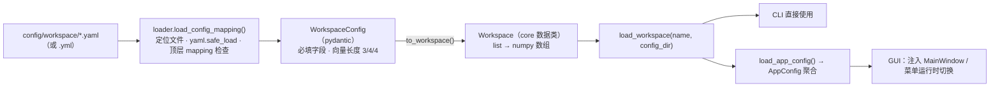

# 配置系统：读取与载入

> 关联文档: [`python-architecture.md`](./python-architecture.md)（§2 分层 / §5.1 Workspace 字段 / §12 配置系统）、[`ui-architecture.md`](./ui-architecture.md)（§7 主窗口职责 / §10 启动链）、[`migration-plan.md`](./migration-plan.md)（M7 资源外置）
> 目的: 把"配置文件从磁盘到 core 对象"的完整链路、约定与扩展方式一次讲清；排查配置问题时先看本文。

## 1. 设计要点（为什么这样分层）

| 原则 | 含义 | 落地 |
|---|---|---|
| 核心无 I/O | `mrex_perception/core/**` 不读文件、不依赖 Qt（保证可无头运行） | core 只接收**已校验的数据对象**（numpy dataclass），从不接触路径 |
| 配置边界层 | 唯一允许读磁盘配置的地方是 `mrex_perception/config/` | `loader.py` 是全项目唯一调用 `yaml.safe_load` 的模块 |
| 双层模型 | schema（pydantic）管校验与报错；core 数据类管计算 | `WorkspaceConfig` →`to_workspace()`→ `Workspace` |
| 聚合注入（A 方案） | 入口层把 `AppConfig` 聚合注入 UI / 引擎 | 新增配置 section 只长在 `AppConfig` 里，消费方构造签名不变 |
| 依赖单向 | `ui / cli → config → core`，数据随注入流入，core 从不反向引用 | core 内检索不到任何 `config` 导入 |

## 2. 文件与职责

| 文件 | 职责 |
|---|---|
| `mrex_perception/config/loader.py` | 通用机制：`config_root()` 定位仓库 `config/`；`load_config_mapping()` 解析 `.yaml`/`.yml`、要求顶层 mapping、给出清晰报错 |
| `mrex_perception/config/workspace.py` | `WorkspaceConfig`（pydantic schema）+ `load_workspace()`（加载入口）+ `list_workspace_configs()`（枚举可用配置） |
| `mrex_perception/config/app.py` | `AppConfig` 聚合（frozen，装已校验的 core 对象）+ `load_app_config()` |
| `config/workspace/*.yaml` | 实际配置数据；仓库级**外部资源**（打包时随包发布，见 M7） |

## 3. 读取载入全流程

链路上的校验点与失败表现：

| 步骤 | 检查内容 | 失败表现 |
|---|---|---|
| 定位文件 | 依次探测 `<dir>/<name>.yaml` → `<name>.yml` | `FileNotFoundError: Workspace config file not found: <path>`（含预期路径） |
| 解析 YAML | `yaml.safe_load`；空文件视为 `{}` | `yaml.YAMLError`（⚠ 见 §5 已知局限） |
| 顶层类型 | 必须是 mapping | `ValueError: ... is not a mapping: <path>` |
| 必填字段 | pydantic 原生校验，11 个字段缺一不可 | `ValidationError`，消息包含缺失字段名 |
| 向量长度 | `size` / `source_region` / `moved_region` = 3 / 4 / 4 个值 | `ValueError: ... must contain 3, 4, and 4 values.` |
| 类型转换 | `to_workspace()` 把 list 转成 numpy 数组 | —（纯转换） |

错误呈现：CLI → stderr 打印 `[error] ...` 并退出码 1；GUI → 弹窗"配置加载失败"；两侧共用同一异常集合 `(FileNotFoundError, OSError, ValueError)`。

**一次具体过程（以 `default` 为例）**：

1. `load_workspace("default")`（或 `load_app_config()` 内部）→ 解析 `config/workspace/default.yaml`；
2. `load_config_mapping` 读取 YAML → `{"size": [100, 40, 10], ..., "material": "glass", ...}`；
3. `WorkspaceConfig.model_validate(data)` 校验 11 个字段与向量长度；
4. `to_workspace()` 生成 `Workspace`（`size` 等变为 `np.asarray(..., dtype=float)`）；
5. GUI 场景 `viewports.set_workspace(workspace)` 画包围盒/区域；运行时 `populate_random(...)`、`ToolHead.for_workspace(...)` 等按字段派生行为。

## 4. 谁在什么时机读取

| 入口 | 调用 | 时机 / 语义 |
|---|---|---|
| 无头 CLI（`cli.py`） | `load_workspace(args.config)` | 每次 `run` 前加载；结果作为引擎构造参数（`--config`，默认 default） |
| GUI 启动（`main.py`） | `MainWindow(load_app_config(args.config))` | `--config NAME`，默认 default；窗口构造时 `viewports.set_workspace(...)` |
| GUI 运行时切换 | Config 菜单：`list_workspace_configs()` → `_select_config()` → `load_app_config(name)` → `apply_config()` | 运行中禁用（`_sync_actions`）+ `apply_config` 双重拦截；切换后重画静态场景、清空遥测，**下一次运行生效**（embryos / tool 在 `start_run` 时按新配置现场派生） |
| 测试 | `load_workspace("alt", config_dir=tmp_path)`、`AppConfig(workspace=ws)` | `config_dir` 可指向临时目录；`AppConfig` 可直接构造注入 |

core 内对 workspace 的消费点（只读）：`pixel_to_workspace`、`populate_random`、`ToolHead.for_workspace`、`next_moved_position`，以及 UI 侧相机取景用的 `size`。

## 5. 约定与已知局限（如实记录）

- 键名 **snake_case**、与 Python 属性逐一对应；字段全集见 `python-architecture.md` §5.1。
- 同名时 `.yaml` 优先于 `.yml`；枚举接口（`list_workspace_configs`）两种扩展名都收，按 stem 去重排序。
- **无默认合并、无自动创建**：文件缺失即报错（与 MATLAB 端约定一致，`createWorkspace` 语义）。
- `loader.require_fields` 是早期手写校验的遗留助手，现无调用方（必填校验已全部交给 pydantic）——新代码不要使用。
- ⚠ **YAML 语法错误**抛 `yaml.YAMLError`，它不属于当前入口层捕获的 `(FileNotFoundError, OSError, ValueError)` 集合：畸形 YAML 会以未捕获异常形式冒出（CLI 会打印 traceback）。修复只需把 `YAMLError` 纳入捕获/包装（未做）。
- 11 个字段中，目前 core 实际消费的只有 `source_region`、`moved_region`、`moved_spacing`（UI 另用 `size`）；7 个材质/物理字段暂存未用——做"实时调参"前先知悉这一点。
- `config/` 按仓库相对位置解析（`config_root()`）；打包/换机时随包发布。若未来要用户自定义路径，只需扩展 `config_root()` 一处。

## 6. 扩展指南

**a) 新增一份 workspace 配置（日常最常用）**
把 YAML 放入 `config/workspace/` 即完成：CLI `--config <name>` 直接可用，GUI 的 Config 菜单自动列出。

**b) 新增一类配置（以 tool 为例，三步）**
1. 按 `workspace.py` 同款模式建 `config/tool.py`：pydantic schema（如 `ToolConfig`）+ `to_tool(workspace)` 转换函数 + `load_tool()`（复用 `load_config_mapping`）；
2. 在 `app.py` 的 `AppConfig` 里加一个字段（如 `tool: ToolHead | None = None`），`load_app_config()` 负责装配；
3. 消费方读取 `config.tool` 即可——**构造签名不变**，这正是 A 方案的目的。

**c) 已规划的下一步（与 §12 对应）**
- `config/app.yaml`：应用默认值（mode / source / num_steps / seed / 主题）；优先级：CLI/UI 显式传参 > `app.yaml` > 代码内默认值。
- 参数仪表（WorkspaceEditor）：编辑 `WorkspaceConfig` 草稿 → 校验 → `to_workspace()` → `apply_config()`，复用本文同一条链路。

## 7. 速查

| 想做什么 | 怎么做 |
|---|---|
| GUI 指定配置启动 | `python -m mrex_perception --config NAME` |
| CLI 指定配置运行 | `python -m mrex_perception.cli run --config NAME ...` |
| 代码里取 Workspace | `from mrex_perception.config.workspace import load_workspace` |
| 代码里取聚合配置 | `from mrex_perception.config.app import load_app_config` |
| 列出全部配置名 | `list_workspace_configs()` |
| 测试用临时配置 | `load_workspace("alt", config_dir=tmp_path)` |

---
> 更新记录: 2026-10-06 首版（配合 AppConfig 聚合注入 Phase 1 实装整理）。
