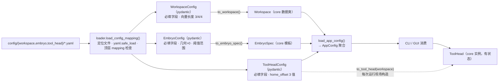

# 配置系统：读取与载入

> 关联文档: [`python-architecture.md`](./python-architecture.md)（§2 分层 / §5.1 Workspace 字段 / §12 配置系统）、[`ui-architecture.md`](./ui-architecture.md)（§7 主窗口职责 / §10 启动链）、[`migration-plan.md`](./migration-plan.md)（M7 资源外置）
> 目的: 把"配置文件从磁盘到 core 对象"的完整链路、约定与扩展方式一次讲清；排查配置问题时先看本文。

## 1. 设计要点（为什么这样分层）

| 原则 | 含义 | 落地 |
|---|---|---|
| 核心无 I/O | `mrex_perception/core/**` 不读文件、不依赖 Qt（保证可无头运行） | core 只接收**已校验的数据对象**（numpy dataclass），从不接触路径 |
| 配置边界层 | 唯一允许读磁盘配置的地方是 `mrex_perception/config/` | `loader.py` 是全项目唯一调用 `yaml.safe_load` 的模块 |
| 双层模型 | schema（pydantic）管校验与报错；core 数据类管计算 | `WorkspaceConfig` → `to_workspace()` → `Workspace`；`EmbryoConfig` → `EmbryoSpec`；`ToolHeadConfig` → `to_tool_head()` 工厂 |
| 聚合注入（A 方案） | 入口层把 `AppConfig` 聚合注入 UI / 引擎 | 新增配置 section 只长在 `AppConfig` 里，消费方构造签名不变 |
| 依赖单向 | `ui / cli → config → core`，数据随注入流入，core 从不反向引用 | core 内检索不到任何 `config` 导入 |

## 2. 文件与职责

| 文件 | 职责 |
|---|---|
| `mrex_perception/config/loader.py` | 通用机制：`config_root()` 定位仓库 `config/`；`load_config_mapping()` 解析 `<name>.yaml`、要求顶层 mapping、给出清晰报错 |
| `mrex_perception/config/workspace.py` | `WorkspaceConfig`（pydantic schema）+ `load_workspace()`（加载入口）+ `list_workspace_configs()`（枚举可用配置） |
| `mrex_perception/config/embryo.py` | `EmbryoConfig`（批次几何 + detection/clustering/placement 阈值）+ `load_embryo()`（→ core `EmbryoSpec`）+ `list_embryo_configs()` |
| `mrex_perception/config/tool_head.py` | `ToolHeadConfig`（本体/交互面几何 + adhesion 系数 + 运动学）+ `to_tool_head(workspace)` 工厂 + `load_tool_head()` / `list_tool_head_configs()` |
| `mrex_perception/config/app.py` | `AppConfig` 聚合（frozen：workspace/embryo 为已校验 core 数据，tool 为工厂）+ `load_app_config()` |
| `config/workspace/*.yaml`、`config/embryo/*.yaml`、`config/tool_head/*.yaml` | 实际配置数据；仓库级**外部资源**（打包时随包发布，见 M7） |

## 3. 读取载入全流程

链路上的校验点与失败表现：

| 步骤 | 检查内容 | 失败表现 |
|---|---|---|
| 定位文件 | 解析 `<dir>/<name>.yaml`（仅 .yaml 后缀） | `FileNotFoundError: Workspace config file not found: <path>`（含预期路径） |
| 解析 YAML | `yaml.safe_load`；空文件视为 `{}` | `yaml.YAMLError`（⚠ 见 §5 已知局限） |
| 顶层类型 | 必须是 mapping | `ValueError: ... is not a mapping: <path>` |
| 必填字段 | pydantic 原生校验（workspace 11 个 / embryo 7 个 / tool head 14 个字段，缺一不可） | `ValidationError`，消息包含缺失字段名 |
| 向量长度 | `size` / `source_region` / `moved_region` = 3 / 4 / 4 个值 | `ValueError: ... must contain 3, 4, and 4 values.` |
| 数值约束 | `Field` 约束：tool 的 `radius/diameter/height > 0`、`reference_width > 0`、`max_attempts ≥ 1`；embryo 的几何 > 0、`min_confidence ∈ [0,1]` | `ValidationError` |
| home_offset | tool head 必须有 3 个值 | `ValueError: home_offset must contain 3 values.` |
| 类型转换 | `to_workspace()` / `to_embryo_spec()` 把 list 转成 numpy / core 对象；`ToolHeadConfig` 保持工厂 | —（纯转换） |

错误呈现：CLI → stderr 打印 `[error] ...` 并退出码 1；GUI → 弹窗"配置加载失败"；两侧共用同一异常集合 `(FileNotFoundError, OSError, ValueError)`。

**一次具体过程（以 `default` 为例）**：

1. `load_app_config("default")` 依次加载三个 section（workspace → embryo → tool_head）；
2. `load_config_mapping` 读取 YAML → `{"size": [100, 40, 10], ..., "material": "glass", ...}`；
3. 各自的 `model_validate(data)` 校验字段（含向量长度 / 数值约束 / `home_offset`）；
4. `to_workspace()` / `to_embryo_spec()` 生成 core 对象（`size` 等变为 `np.asarray(..., dtype=float)`）；tool 保持 `ToolHeadConfig` 不预构造；
5. GUI 场景 `viewports.set_workspace(workspace)` 画包围盒/区域；运行时 `populate_random(..., spec)`、`config.tool.to_tool_head(workspace)`（每次运行新实例）等按字段派生行为。

## 4. 谁在什么时机读取

| 入口 | 调用 | 时机 / 语义 |
|---|---|---|
| 无头 CLI（`cli.py`） | `load_app_config(args.config, args.tool, args.embryo)` | 每次 `run` 前加载三个 section（`--config` / `--tool` / `--embryo`，默认 default）；tool 在引擎构造时用 `to_tool_head(workspace)` 现场构造 |
| GUI 启动（`main.py`） | `MainWindow(load_app_config(args.config))` | `--config NAME` 选 workspace，默认 default（tool/embryo 暂用 default 配置）；窗口构造时 `viewports.set_workspace(...)` |
| GUI 运行时切换 | Config 菜单：`list_workspace_configs()` → `_select_config()` → `load_app_config(name)` → `apply_config()` | 运行中禁用（`_sync_actions`）+ `apply_config` 双重拦截；切换后重画静态场景、清空遥测，**下一次运行生效**（embryos / tool 在 `start_run` 时按新配置现场派生） |
| 测试 | `load_workspace("alt", config_dir=tmp_path)`、`load_app_config("alt", config_dir=root)`、`AppConfig(workspace=ws, embryo=..., tool=...)` | 单节 loader 的 `config_dir` 指向该节目录；`load_app_config` 的 `config_dir` 指向 config 根目录（需含三个子目录）；`AppConfig` 可直接构造注入 |

core 内对配置的消费点（只读）：`pixel_to_workspace`、`populate_random`（`EmbryoSpec`：几何 + `min_spacing`）、`from_detections`（`spec.min_confidence` + 几何）、`mark_clustered`（引擎透传 `cluster_threshold`）、`pickup_probability(embryo, tool)`（tool 的 adhesion 系数）、`next_moved_position`，以及 UI 侧相机取景用的 `size`。

## 5. 约定与已知局限（如实记录）

- 键名 **snake_case**、与 Python 属性逐一对应；字段全集见 `python-architecture.md` §5.1。
- 仅支持 `.yaml` 后缀（项目约定）；枚举接口（`list_workspace_configs`）只枚举 `*.yaml`，按名称排序。
- **无默认合并、无自动创建**：文件缺失即报错（与 MATLAB 端约定一致，`createWorkspace` 语义）。
- `loader.require_fields` 是早期手写校验的遗留助手，现无调用方（必填校验已全部交给 pydantic）——新代码不要使用。
- ⚠ **YAML 语法错误**抛 `yaml.YAMLError`，它不属于当前入口层捕获的 `(FileNotFoundError, OSError, ValueError)` 集合：畸形 YAML 会以未捕获异常形式冒出（CLI 会打印 traceback）。修复只需把 `YAMLError` 纳入捕获/包装（未做）。
- 11 个字段中，目前 core 实际消费的只有 `source_region`、`moved_region`、`moved_spacing`（UI 另用 `size`）；7 个材质/物理字段暂存未用——做"实时调参"前先知悉这一点。
- 三个 section 现状（2026-10-08）：`workspace` / `embryo` / `tool_head`。`load_embryo()` 返回 core `EmbryoSpec`（纯数据）；`load_tool_head()` 返回 `ToolHeadConfig` 工厂——tool 有状态，**不可**在 AppConfig 里预构造单个实例，运行时用 `to_tool_head(workspace)` 新造（CLI/GUI 均在每次 start 时构造）。
- `AppConfig` 三个字段均为必填；`load_app_config` 的 `config_dir` 语义 = 覆盖仓库 `config/` **根目录**（应含 `workspace/`、`embryo/`、`tool_head/` 三个子目录），与单节 loader（`load_workspace` 等）的"该节目录"语义不同。
- tool head / embryo 的嵌套段（`contact_surface` / `adhesion` / `detection` / `clustering` / `placement`）要求完整书写；同样无默认合并，缺字段即报错。
- `config/` 按仓库相对位置解析（`config_root()`）；打包/换机时随包发布。若未来要用户自定义路径，只需扩展 `config_root()` 一处。

## 6. 扩展指南

**a) 新增一份 workspace 配置（日常最常用）**
把 YAML 放入 `config/workspace/` 即完成：CLI `--config <name>` 直接可用，GUI 的 Config 菜单自动列出。

**b) 新增一类配置（参照已实装的 `embryo.py` / `tool_head.py`，三步）**
1. 按同款模式建 `config/<type>.py`：pydantic schema + 转换/工厂函数（纯数据用 `to_...()`，有状态对象用 `to_...(workspace)` 工厂，见 `tool_head.py`）+ `load_<type>()`（复用 `load_config_mapping`）；
2. 在 `app.py` 的 `AppConfig` 里加一个字段，`load_app_config()` 负责装配；
3. 消费方读取 `config.<type>` 即可——**构造签名不变**，这正是 A 方案的目的。

**c) 已规划的下一步（与 §12 对应）**
- `config/app.yaml`：应用默认值（mode / source / num_steps / seed / 主题）；优先级：CLI/UI 显式传参 > `app.yaml` > 代码内默认值。
- GUI 侧：Config 菜单扩展到 tool head / embryo 配置枚举与切换（目前仅 workspace）。
- 参数仪表（WorkspaceEditor / ToolHeadEditor）：编辑草稿 → 校验 → `to_...()` → `apply_config()`，复用本文同一条链路。

## 7. 速查

| 想做什么 | 怎么做 |
|---|---|
| GUI 指定配置启动 | `python -m mrex_perception --config NAME`（workspace；tool/embryo 用 default） |
| CLI 指定配置运行 | `python -m mrex_perception.cli run --config NAME --tool T --embryo E ...` |
| 代码里取 Workspace / EmbryoSpec / ToolHeadConfig | `load_workspace()` / `load_embryo()` / `load_tool_head()` |
| 代码里取聚合配置 | `from mrex_perception.config.app import load_app_config` |
| 构造本运行的工具头 | `config.tool.to_tool_head(config.workspace)` |
| 列出配置名 | `list_workspace_configs()` / `list_embryo_configs()` / `list_tool_head_configs()` |
| 测试用临时配置（单节） | `load_workspace("alt", config_dir=tmp_path)` |
| 测试用临时配置（聚合根） | `load_app_config("alt", config_dir=root)`（root 需含三个子目录） |

---
> 更新记录: 2026-10-06 首版（配合 AppConfig 聚合注入 Phase 1 实装整理）；2026-10-08 增补 embryo / tool head 两个 section（pickup probability 系数参数化）。
