# M-REx Perception — MATLAB → Python 迁移计划

> 版本: v0.1（草案） · 日期: 2026-10-01 · 状态: 待评审
>
> 关联文档: [`python-architecture.md`](./python-architecture.md)
>
> 总体策略：**先逻辑、后界面；先仿真、后硬件；先随机源、后 YOLO。** MATLAB 代码冻结为参考实现，双轨并行验证，验证通过前不删除任何 MATLAB 文件。

---

## 1. 里程碑总览

| 阶段 | 内容 | 交付物 | 验收标准 | 参考工作量* |
|---|---|---|---|---|
| **M0** | 环境与骨架 | pyproject、`mrex_perception` 包骨架、启动空窗口 | `python -m mrex_perception` 弹出含三视图空窗口；依赖可导入 | 0.5–1 天 |
| **M1** | 核心数据与配置 | `core/models`、`config/workspace`、`core/embryos`、`geometry` | 单元测试绿；随机布置/聚类/pixel 映射与 MATLAB 对照通过 | 1–1.5 天 |
| **M2** | 运动·抓取·记录·汇总 | `core/motion`、`grasping`、`motion_log`、`summary`、`planner` | 固定 fixture 与 MATLAB 逐字段对齐（容差 1e-9） | 1.5–2 天 |
| **M3** | 无头仿真引擎 | `core/engine` + CLI（`python -m mrex_perception.cli run`） | 端到端随机仿真跑通并输出 JSON 汇总；停止语义正确 | 1 天 |
| **M4** | GUI（MVP 关键路径） | 三视图 + 仪表盘 + worker 线程 | 6 胚仿真 ≥50 FPS 无卡顿；Stop ≤200 ms；运行中可安全关窗 | 2–3 天 |
| **M5** | YOLO 接入 | `YoloSource` 实装（方案 A/B 择一） | `sample.jpg` 检出胚并进入仿真；与 MATLAB 路径同 CSV 对齐 | 1 天 |
| **M6** | 硬件接入 | `SerialPump` + 释放序列 | 虚拟串口环回测试通过；仿真模式零等待 | 0.5–1 天 |
| **M7** | 打包发布 | PyInstaller 构建（Sim / Full-CV 两级） | 干净机器（无 Python）可运行仿真全流程 | 0.5–1 天 |

\* 参考工作量按熟悉 Python/Qt 的开发者估算，不含学习时间。**MVP 门槛 = M0–M4**；在此之前 YOLO 与硬件全部用占位/仿真实现，保证"纯虚拟环境跑通逻辑"这一首要目标。

```mermaid
gantt
    title 迁移路线（以工作日为单位，可并行压缩）
    dateFormat  X
    axisFormat %s
    section 核心
    M0 环境与骨架           :m0, 0, 1
    M1 数据与配置           :m1, after m0, 2
    M2 运动抓取汇总         :m2, after m1, 2
    M3 无头引擎             :m3, after m2, 1
    section 界面
    M4 GUI                  :m4, after m3, 3
    section 扩展
    M5 YOLO 接入            :m5, after m4, 1
    M6 硬件接入             :m6, after m5, 1
    M7 打包                 :m7, after m6, 1
```



---

## 2. M0 — 环境与骨架（✅ 完成于 2026-10-01）

### 任务清单

- [x] 根目录创建 `.venv`（Python 3.12.8）；初始化 `pyproject.toml`
- [x] 安装：`numpy`、`PySide6`、`pyvista`、`pyvistaqt`、`pyqtgraph`、`PyYAML`、`pydantic`
- [x] 安装开发工具：`pytest`、`pytest-qt`、`ruff`、`mypy`
- [x] 创建 `mrex_perception/` 包骨架（目录结构见架构文档 §4），`python -m mrex_perception` 启动
- [x] `MainWindow`：菜单栏 + 左仪表盘占位 + 右 2×2 网格放 3 个空白 `QtInteractor`（Top/Front/Right）+ 状态栏
- [x] VS Code：`.vscode/settings.json` 指定解释器
- [x] Qt Designer 扩展（`seanwu.vscode-qt-for-python`）；`MainWindow`/`Dashboard` 迁移为 `.ui` + `pyside6-uic`（VS Code 任务「uic: 编译全部 .ui」）

### 验收

- 窗口可启动、可关闭；三个视口可见并显示坐标轴指示器；无异常堆栈。
- `pytest` 可执行（0 用例也算通过）。

### 风险与对策

| 风险 | 对策 |
|---|---|
| VTK/Qt 轮子安装失败（macOS arm64） | 先用 `pyvista` 官方推荐版本组合；必要时降 Python 版本至 3.11 |
| 与 `python/.venv`（YOLO 侧）环境混淆 | 明确两环境职责：根 `.venv` = 应用，`python/.venv` = YOLO 推理；M5 前互不干扰 |

---

## 3. M1 — 核心数据与配置（✅ 完成于 2026-10-02）

### 任务清单

- [x] `core/states.py`：`EmbryoState` / `ToolState` 枚举，字符串值与 MATLAB 完全一致
- [x] `core/models.py`：`Workspace`、`Embryo`、`ToolHead` 数据类（字段表见架构文档 §5）
- [x] `config/workspace.py`：PyYAML + pydantic 加载 `config/workspace/default.yaml`（**字段名不改**），校验规则对齐 `loadWorkspaceConfig.m`
- [x] `core/geometry.py`：`pixel_to_workspace`（已与 MATLAB 逐位对照：6 样例 `%.17g` 完全一致）
- [x] `core/embryos.py`：`populate_random`、`from_detections`（先用手造 CSV/记录测试）、`mark_clustered`
- [x] `core/tool.py`：`create_tool_head`（含初始位置 `[15, 17.5, 10]` 的推导式）
- [x] `tests/fixtures/scenario_basic.json`：固定工作区 + 固定 6 胚（位置/朝向/attempts 全部显式）
- [x] 单元测试：`test_workspace.py`、`test_embryos.py`、`test_geometry.py`、`test_tool.py`（29 用例全绿）

### 验收

- `populate_random`：数量正确、均在源区域内、间距 ≥1 mm、z=0.1、yaw∈[0,2π)、seed 固定时结果可复现。
- `mark_clustered`：构造 3 胚（两近一远）→ 近端两胚 `clustered`，远端保持 `free`。
- `pixel_to_workspace`：与 MATLAB 输出逐值一致（手算 3 个样例 + MATLAB 导出对照）。
- YAML 加载：缺字段/长度错误时给出清晰错误（对齐 MATLAB 报错信息含义）。

---

## 4. M2 — 运动·抓取·记录·汇总

### 任务清单

- [ ] `core/motion_log.py`：`MotionLog` + `record_tool_motion`（ZYX 提取 + 万向锁分支）
- [ ] `core/motion.py`：`move_tool`（最短角插值、胚随动、`on_step` 回调、`stop_token`）
- [ ] `core/motion.py`：`move_tool_to_embryo` / `move_tool_final` / `raise_tool` / `return_home`
- [ ] `core/motion.py`：`lower_tool` / `lower_tool_moved`（legacy，仅移植不接入）
- [ ] `core/planner.py`：`has_free_embryos` / `select_nearest_free` / `select_embryo` / `next_moved_position`
- [ ] `core/grasping.py`：`pickup_probability` / `grasp` / `release`（RNG 与 Pump 注入）
- [ ] `core/summary.py`：`compute_summary` → `SummaryReport`（字段对齐 `simulationSummary.m`）
- [ ] `tests/matlab/dumpFixture.m`【可选但强烈建议】：MATLAB 侧读同一 fixture、跑同一函数、导出 JSON
- [ ] 单元测试：`test_motion.py`、`test_grasping.py`、`test_planner.py`、`test_summary.py`

### 验收（数值对齐，容差 1e-9）

| 检查点 | 方法 |
|---|---|
| 单次 `move_tool` 轨迹 | 固定起点/终点/朝向；对比 50 步的 `positions`、`rotation`、`state` 序列 |
| yaw 最短角 | 构造跨 ±π 的用例（如 start=170°, target=-170°）验证走 20° 而非 340° |
| 胚随动 | `has_embryo=True` 时对比胚 position/orientation 每步 |
| `next_moved_position` | 分别构造 moved_count = 0, 1, 49, 50（换行）验证 col/row 网格与边界报错 |
| 抓取路径 | 强制成功 / 强制失败×3 两种 outcome；对比 attempts、state、`failedGrasp` |
| `compute_summary` | 用同一 `motionLog` 数据对比全部统计字段（含 `np.unwrap` 结果） |

---

## 5. M3 — 无头仿真引擎

### 任务清单

- [ ] `core/engine.py`：`SimulationEngine`（主循环、阶段事件、停止/暂停令牌、快照构造）
- [ ] `mrex_perception/cli.py`：`python -m mrex_perception.cli run --config default --source random --count 6 --seed 42 --steps 50 --report out.json`
- [ ] 引擎测试：完整跑通（随机 + fixture 两种输入）；步间停止；落位区满；无可用胚（全部 clustered）
- [ ] 汇总导出：`SummaryReport → JSON`（同时保留 `fprintf` 风格文本用于人工对照）

### 验收

- 随机 6 胚、seed 固定：全部 `moved` 或按概率路径收尾，状态分布自洽（总账：moved+failed+free+clustered+selected+grasped = total）。
- 全流程无 UI 依赖（`import mrex_perception.core` 不引入 Qt）。
- Stop 语义：在任一插值步置停 → 立即 break，`FinishReason.STOPPED`，不回位、不产汇总（对齐 MATLAB）。
- 与 MATLAB 的对照：固定 fixture + 强制抓取结果 → 汇总 JSON 全字段一致。

---

## 6. M4 — GUI（MVP 关键路径）

### 任务清单

- [ ] `ui/snapshot.py`：`Snapshot`（深拷贝的小型只读数据：胚胎数组、工具、阶段标题、步数、统计增量）
- [ ] `SimulationWorker(QThread)`：运行引擎；覆盖式快照缓冲；`snapshot`/`phase`/`finished`/`failed` 信号；暂停/停止/单步命令
- [ ] `ui/viewport.py`：三视图（正交 Top/Front/Right）、包围盒、区域矩形、Fit All、视图复位
- [ ] `ui/renderer.py`：状态颜色映射、椭球（缩放+旋转+平移）、工具圆柱、ID 标签、朝向箭头
- [ ] `ui/dashboard.py`：控件清单（架构文档 §9.1）逐项实现；参数改动实时生效（下一次运行或即时）
- [ ] `ui/charts.py`：Z-时间 / yaw-时间 / 累计路程（pyqtgraph，数据来自快照增量）
- [ ] `ui/screenshot.py`：三视图/整窗截图导出
- [ ] 关闭窗口安全退出；异常经 `failed` 信号呈现
- [ ] `pytest-qt` 冒烟测试 + 手动验收

### 验收

- 6 胚全流程在 GUI 中跑完：三视图动画流畅（≥50 FPS，状态栏显示 FPS），无卡死、无闪退。
- Stop 按钮：点击到停下 ≤200 ms；停后 Start 可重跑（Reset 之后）。
- 运行中直接关窗：进程 2 s 内干净退出，无 crash 报告。
- 仪表与曲线数据与无头 CLI 的 JSON 汇总一致。
- Pause/Step（若实现）：单步粒度 = 一个插值步。

### 风险与对策

| 风险 | 对策 |
|---|---|
| worker 直接操作 VTK 导致崩溃 | 铁律：渲染只在主线程；code review 检查 `mrex_perception/ui` 中线程使用 |
| 信号频率高于渲染能力 | latest-wins 缓冲 + UI 端 QTimer 拉取（架构文档 §7） |
| VTK 释放顺序导致退出崩溃 | `closeEvent` 中断线程 → `plotter.close()` → `deleteLater()` 固定顺序 |

---

## 7. M5–M7 — 扩展与发布

### M5 — YOLO 接入

- [ ] 方案 A（推荐先行）：`YoloSource` 子进程调用 `python/.venv` 的 `extract_obb_data.py` → 读 CSV → `from_detections`；与 MATLAB `detectEmbryos` 路径产出对照（同一 `sample.jpg` 同一模型）。
- [ ] 方案 B（可选）：同进程 `ultralytics` 惰性导入 + 预热线程；评估打包体积与 AGPL 许可。
- [ ] UI：Image 源选择文件 → 检出的胚显示在视图中（含 confidence 列表）。
- 验收：`sample.jpg` 检出结果与 MATLAB 运行时一致（同一 CSV 逐行一致或经 `from_detections` 后逐字段一致）。

### M6 — 硬件接入

- [ ] `SerialPump`：pyserial，命令集与 `releaseWithPump.m` 逐条对齐（含 `cvolume`/`irun`/`wrun`、等待时间）。
- [ ] 虚拟串口环回测试（macOS：`socat` 或调试器；Windows：com0com）。
- [ ] UI：Hardware 模式启用条件、连接状态指示、错误处理（超时/断线）。
- 验收：仿真模式绝不产生真实等待；硬件序列在环回测试中命令顺序与 MATLAB 完全一致。

### M7 — 打包发布

- [ ] `pyinstaller` spec：Sim 构建（排除 torch/ultralytics）与 Full-CV 构建两级。
- [ ] 资源外置：`config/`、`python/models/`、`doc/` 随包；首启检测并提示缺失。
- [ ] 干净机器冒烟（无 Python、无 MATLAB）：随机源全流程 → 导出汇总与截图。
- 验收：见 §9 最终清单。

---

## 8. MATLAB → Python 函数级映射表

| MATLAB 文件 | Python 目标 | 备注 |
|---|---|---|
| `runSimulation.m`（主脚本） | `core/engine.py` + `main.py` + `ui/main_window.py` | 主循环拆为引擎；脚本级配置变为 `EngineParams` + UI |
| `src/setup/createWorkspace.m` | `config/workspace.py::load_workspace` | |
| `src/setup/loadWorkspaceConfig.m` | `config/workspace.py`（pydantic 校验） | 含 readSimpleYaml → 换 PyYAML |
| `src/setup/populateEmbryos.m` | `core/embryos.py::populate_random` | RNG 注入 |
| `src/setup/createEmbryoFromYOLO.m` | `core/embryos.py::from_detections` | 置信度 0.8 过滤 |
| `src/setup/pixelToWorkspace.m` | `core/geometry.py::pixel_to_workspace` | |
| `src/setup/createToolHead.m` | `core/tool.py::create_tool_head` | |
| `src/detection/detectEmbryos.m` | `detection/base.py` + `detection/yolo.py`（占位） | |
| `src/detection/runYOLO.m` | `detection/yolo.py::run_extraction`（M5） | 子进程 + CSV |
| `src/detection/detectClusteredEmbryos.m` | `core/embryos.py::mark_clustered` | 阈值 1 mm（2D） |
| `src/planning/hasFreeEmbryos.m` | `core/planner.py::has_free_embryos` | |
| `src/planning/selectNearEmbryo.m` | `core/planner.py::select_nearest_free` | |
| `src/planning/selectEmbryos.m` | `core/planner.py::select_embryo` | 先清 selected 再置新 |
| `src/planning/getMovedPosition.m` | `core/planner.py::next_moved_position` | 网格公式 + 容量报错 |
| `src/planning/pickupModel.m` | `core/grasping.py::pickup_probability` | |
| `src/motion/moveTool.m` | `core/motion.py::move_tool` | `on_step` 回调、stop token |
| `src/motion/moveToolToEmbryo.m` | `core/motion.py::move_tool_to_embryo` | |
| `src/motion/moveToolFinal.m` | `core/motion.py::move_tool_final` | |
| `src/motion/raiseTool.m` | `core/motion.py::raise_tool` | |
| `src/motion/returnHome.m` | `core/motion.py::return_home` | |
| `src/motion/lowerTool.m` | `core/motion.py::lower_tool` | **legacy，主循环未调用**；原实现参数错位 + 拼写错误（从未可用），Python 按语义实现修正版但不接入 |
| `src/motion/lowerToolMoved.m` | `core/motion.py::lower_tool_moved` | legacy，主循环未调用；原实现参数错位，同上处理 |
| `src/motion/initializeMotionLog.m` | `core/motion_log.py::MotionLog` | |
| `src/motion/recordToolMotion.m` | `core/motion_log.py::record_tool_motion` | ZYX + 万向锁分支 |
| `src/grasping/graspEmbryo.m` | `core/grasping.py::grasp` | attempts 先自增 |
| `src/grasping/releaseEmbryo.m` | `core/grasping.py::release` | 固定 yaw=π/2 |
| `src/hardware/releaseWithPump.m` | `hardware/serial_pump.py::dispense/withdraw`（M6） | rate=20, vol=2.7 |
| `src/reporting/simulationSummary.m` | `core/summary.py::compute_summary` | 输出格式化移到呈现层 |
| `src/visualization/plotEmbryos3D.m` | `ui/renderer.py::build_embryo_mesh` | |
| `src/visualization/plotToolHead3D.m` | `ui/renderer.py::build_tool_mesh` | |
| `src/visualization/updateSimulation.m` | `ui/viewport.py::apply_snapshot` | 不再全量 `clf` |
| `src/visualization/addStopControls.m` | `ui/dashboard.py`（Stop 按钮）+ `core/engine.py::StopToken` | |
| `src/visualization/simulationStopped.m` | `core/engine.py::StopToken.is_set` | 全局 appdata 标志改为显式令牌 |
| `src/visualization/saveImage.m` | `ui/screenshot.py::save_screenshots` | `plotter.screenshot` |
| `tests/tst2.m` | `tests/test_*.py` | 旧脚本保留 |
| `python/extract_obb_data.py` | 保持不动；M5 由 `YoloSource` 调用 | CSV 契约不变 |
| `python/train.py` / `convert.py` / `fix_labels.py` | 保持不动 | 训练侧工具链 |

---

## 9. 数值对齐与验证策略

### 9.1 双端对照资产

```
tests/fixtures/scenario_basic.json     # workspace + 胚胎列表 + 工具初始状态 + 引擎参数 + 脚本化抓取结果
tests/matlab/dumpFixture.m             # MATLAB 侧：读 fixture → 逐步执行 → 导出 trace.json
tests/test_parity.py                   # Python 侧：跑同一 fixture → 与 trace.json 对比（容差 1e-9）
```

`scenario_basic.json` 建议结构（示例）：

```json
{
  "workspace": { "size": [100, 40, 10], "sourceregion": [0, 5, 20, 25], "movedregion": [80, 5, 100, 25], "movedSpacing": 4 },
  "embryos": [
    { "state": "free", "attempts": 0, "position": [3.0, 7.0, 0.1], "yaw": 0.5, "width": 0.2, "length": 0.5, "height": 0.2, "confidence": 1.0 }
  ],
  "tool": { "position": [15, 17.5, 10], "yaw": 0.0 },
  "engine": { "num_steps": 4, "target_point": [50, 50, 0.1], "grasp_outcomes": [true, true] }
}
```

### 9.2 对齐边界（重要）

- **确定性部分**（运动插值、网格落位、聚类、像素映射、汇总统计）：要求逐字段对齐，容差 `1e-9`。
- **随机性部分**（`populate_random` 的抽样、`grasp` 的成败）：MATLAB `rand` 与 numpy 序列**本就不同**，不做逐值对比。策略：
  - 随机抽样 → 只对比结构性质（数量/范围/间距/可复现性）；
  - 抓取成败 → fixture 中提供 `grasp_outcomes` 强制结果，双端走同一条路径对比状态迁移；
  - 抓取概率公式单独用固定输入做数值对比（`pickup_probability` 是纯函数，可直接对齐）。
- 对比工具：Python 侧写 `tests/parity_utils.py`（读 JSON、按路径 diff、报告首个不一致字段），失败信息必须含"路径 + 双端值"。

### 9.3 索引与形状陷阱清单（移植时逐条自查）

| 陷阱 | 规则 |
|---|---|
| MATLAB 1-based / numpy 0-based | `attached_embryo_id` 在 Python 内部保持 1-based（0 = 无） |
| 列向量 vs `(3,)` | 统一 `(3,)`；`np.cross`/矩阵乘用 `@` 时注意 reshape |
| `embryos(attachedID).position` 等结构体数组 | Python 用 `list[Embryo]`，ID ↔ 列表下标 `id-1` |
| `atan2` 顺序 | MATLAB `atan2(y,x)`；numpy `np.arctan2(y, x)` 参数顺序一致，勿颠倒 |
| `mod` 负数 | MATLAB `mod` 恒非负、numpy `%` 同；但 numpy `np.mod` 与 `%` 一致，统一用 `%` |
| `unwrap` 维度 | MATLAB `unwrap(rotation, [], 1)` → `np.unwrap(rotation, axis=0)` |
| `vecnorm` | `np.linalg.norm(v, axis=...)` |

---

## 10. 风险登记册

| 风险 | 影响 | 概率 | 对策 |
|---|---|---|---|
| VTK 与 Qt 线程违规导致随机崩溃 | 高 | 中 | 快照模式 + 渲染仅主线程 + CI 冒烟 |
| 数值移植偏差（索引/形状） | 中 | 中 | M2 双端 fixture 对齐 + §9.3 自查清单 |
| PyInstaller + torch 体积/收集复杂 | 中 | 高（Full-CV） | Sim/Full 两级构建；Full-CV 延后；优先方案 A（子进程隔离 YOLO） |
| `clustered` 行为不符实验意图 | 中 | 中 | §16-① 已标记，M1 评审确认 |
| 打包后 VTK 依赖缺失 | 高 | 中 | M7 干净机器验收；`--collect-all vtkmodules` |
| Ultralytics AGPL 许可限制分发 | 高 | 低（学术） | 发布前确认用途；Sim 构建不含 ultralytics |
| 与 `python/.venv` 环境冲突 | 低 | 中 | 职责隔离（应用 venv vs YOLO venv），M5 统一决策 |

---

## 11. 双轨运行与回滚

1. **冻结期**：迁移开始至 M3 验收前，`src/**`、`runSimulation.m` 只读不改；如需修复 MATLAB bug，记录在案并同步 Python。
2. **并行期**（M2–M5）：同一 fixture 双端跑，结果 diff；每周跑一次全量对照。
3. **切换条件**：M4 验收通过（GUI 全流程 + 无头 CLI 结果一致）后，日常使用切换为 Python；MATLAB 仅作参考。
4. **回滚**：任何阶段可直接回到 `runSimulation.m`（不删除、不改坏）；Python 代码始终独立于 MATLAB 目录。
5. **冻结点**：M7 打包验收通过后，可归档 `src/`（保留 git 历史，不再维护）。

---

## 12. 最终验收清单（Definition of Done）

**功能（MVP）**

- [ ] 纯仿真模式全流程：随机 6 胚 → 选择 → 接近 → 抓取 → 搬运 → 释放 → 回零 → 汇总
- [ ] 停止语义与 MATLAB 一致（停止后不回位、不产汇总）
- [ ] 汇总字段与 `simulationSummary.m` 输出一一对应
- [ ] 固定 fixture 双端数值对齐（1e-9）

**界面**

- [ ] 三视图（Top/Front/Right）实时渲染，状态颜色与 MATLAB 映射一致
- [ ] 仪表盘完整（运行控制 / 参数 / 仪表 / 曲线 / 胚胎表）
- [ ] 任意时刻：暂停 ≤1 步、停止 ≤200 ms、关窗干净退出

**工程**

- [ ] `mrex_perception.core` 零 Qt/VTK 依赖（可无头导入执行）
- [ ] pytest 全绿；ruff/mypy 无新增告警
- [ ] `python -m mrex_perception.cli run` 与 GUI 结果一致
- [ ] PyInstaller 干净机器可运行（随机源路径）

**扩展（非 MVP 门槛）**

- [ ] YOLO 源：`sample.jpg` 检出并仿真（与 MATLAB 同 CSV 对齐）
- [ ] 硬件：虚拟串口环回测试通过；仿真模式零等待
