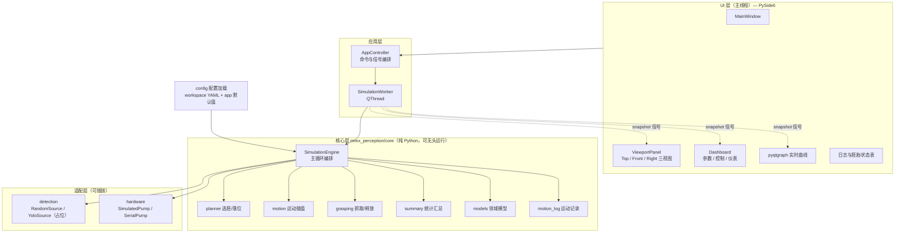
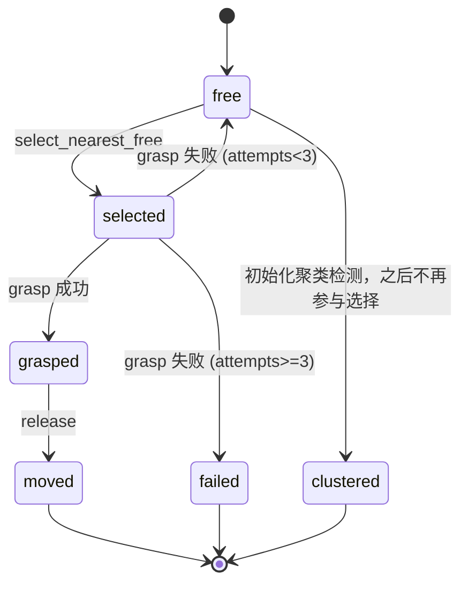
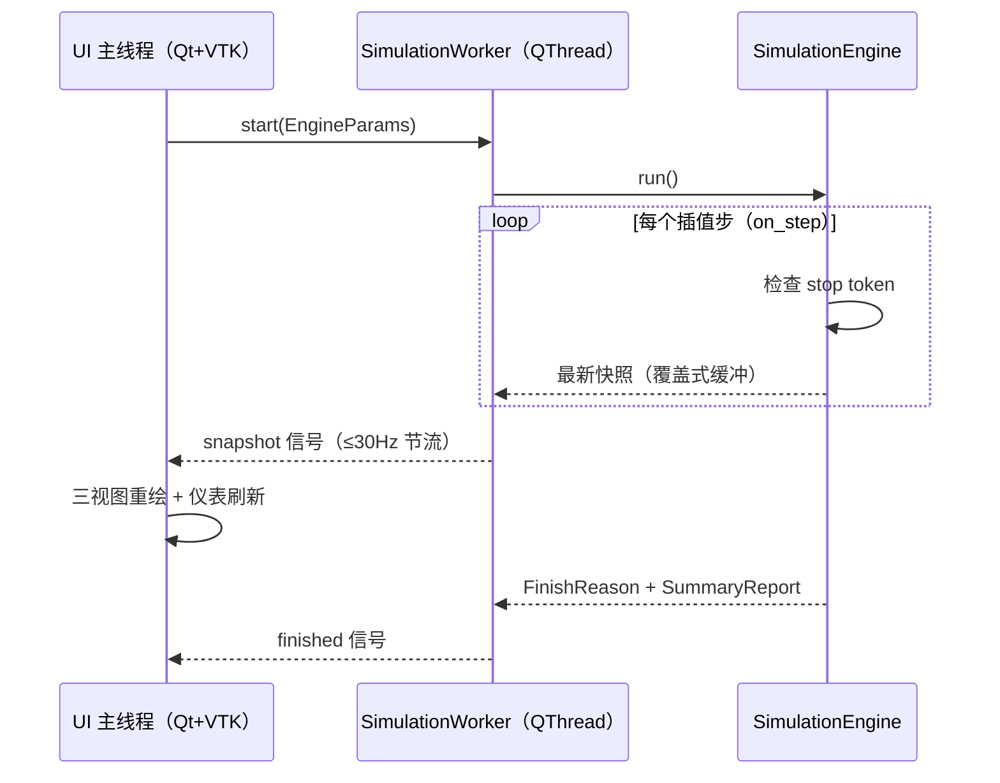

# M-REx Perception — Python 全栈架构设计

> 版本: v0.1（设计草案） · 日期: 2026-10-01 · 状态: 待评审
>
> 技术选型: **Python + PySide6 (Qt6) + PyVista/VTK + pyqtgraph**
>
> 目标: 在完全不依赖 MATLAB 的前提下复刻 `runSimulation.m` 的全部仿真逻辑，并提供 Rhino 式多视图 3D + 仪表盘的现代 GUI。**首期目标是在纯仿真（虚拟）环境中跑通全部逻辑**；YOLO 与实体泵为可插拔的后续阶段（当前以占位接口存在）。

---

## 1. 目标与范围

### 1.1 目标

| # | 目标 | 说明 |
|---|------|------|
| G1 | 逻辑等价 | 复刻 `src/**/*.m` + `runSimulation.m` 的仿真语义（状态机、公式、边界行为） |
| G2 | 纯虚拟可运行 | 仿真模式（无硬件、无 YOLO、无 MATLAB）即可完成完整 pick-and-place 流程 |
| G3 | 现代 GUI | 三个同步 3D 正交视图（Top/Front/Right，Rhino 风格）+ 仪表盘参数/控制/图表 |
| G4 | 可插拔 | 胚胎来源（随机 / YOLO）、泵驱动（仿真 / 串口）均为接口，运行期切换 |
| G5 | 不阻塞 | 仿真运行于工作线程，UI 渲染于主线程，任意时刻可暂停/停止/关闭 |
| G6 | 可打包 | PyInstaller 产出可分发的桌面应用（详见 §14） |
| G7 | VS Code 全流程 | 纯 `.py` + `.md`，全部可在 VS Code 中编辑与调试 |

### 1.2 非目标（当前阶段）

- YOLO 模型训练与数据标注（继续留在 `python/` 目录的既有工具链中）
- 真实机械臂/运动平台控制（当前硬件接口只有注射泵）
- 多用户/网络/远程操作
- 修改既有 MATLAB 代码（MATLAB 仅作为参考实现保留）

---

## 2. 设计原则

1. **核心与 UI 严格分层**：`mrex_perception/core/**` 不 import 任何 Qt/VTK；UI 只消费只读快照。
2. **语义保真优先**：移植阶段遇到 MATLAB 的"怪行为"（如 `clustered` 不参与选择）先原样保留，逐条记录在 §16，评审后再改。
3. **单一数据流**：UI 只通过"命令 → 引擎 → 快照 → 渲染"单向流转，无双向状态同步。
4. **可复现**：所有随机性通过注入的 `numpy.random.Generator` 实现，测试可固定 seed。
5. **线程边界**：仿真在线程 A，渲染在线程 B；两者之间只传不可变快照。
6. **单位与坐标约定**（与 MATLAB 完全一致）：
   - 长度 **mm**，角度内部用 **rad**，仅在 UI 显示时转 deg；
   - 坐标：x、y 为水平面，z 为高度；`pixelToWorkspace` 中图像 y 轴翻转逻辑保持一致；
   - 向量：`numpy.ndarray`，形状 `(3,)`；旋转矩阵 `(3,3)`；位姿 `(4,4)`；运动日志 `(N,3)`。
   - **ID 保持 1 起始**（沿用 MATLAB 语义，UI 显示与日志一致，避免 off-by-one 混淆）。

---

## 3. 总体架构



**数据流一句话**：`UI 命令（start/pause/stop/reset）→ AppController → SimulationWorker(QThread) → SimulationEngine 逐步推进 → 发布不可变 Snapshot → UI 主线程渲染`。

---

## 4. 目录结构

```text
M-REx_Perception/
├── doc/
│   ├── python-architecture.md        # 本文档
│   └── migration-plan.md             # 迁移计划
├── mrex_perception/                  # 【新增】Python 全栈应用
│   ├── __init__.py
│   ├── __main__.py                   # 入口: python -m mrex_perception
│   ├── main.py                       # QApplication 启动与依赖装配
│   ├── core/                         # 【纯逻辑】不依赖 Qt/VTK；按角色分层，依赖只向下
│   │   ├── __init__.py
│   │   ├── math/                     # ① 纯函数：旋转/位姿变换 + 像素映射
│   │   │   ├── transforms.py         # rotation_z / make_pose
│   │   │   └── geometry.py           # pixel_to_workspace 等坐标映射
│   │   ├── models/                   # ② 数据模型（子包 __init__ 转发导出）
│   │   │   ├── states.py             # EmbryoState / ToolState 枚举（字符串值对齐 MATLAB）
│   │   │   └── entities.py           # Workspace / Embryo / ToolHead / Snapshot
│   │   ├── setup/                    # ③ 构造：配置/检测 → 实体
│   │   │   ├── embryos.py            # populate_random / from_detections / mark_clustered
│   │   │   └── tool.py               # create_tool_head
│   │   ├── sim/                      # ④ 运行期行为
│   │   │   ├── planner.py            # has_free / select_nearest_free / next_moved_position
│   │   │   ├── motion.py             # move_tool / raise / lower / return_home ...
│   │   │   ├── motion_log.py         # 运动记录（ZYX 欧拉角提取）
│   │   │   └── grasping.py           # pickup_probability / grasp / release
│   │   ├── reporting/                # ⑤ 结果输出
│   │   │   └── summary.py            # compute_summary（对应 simulationSummary.m）
│   │   └── engine.py                 # SimulationEngine：主循环 + 停止/暂停令牌
│   ├── detection/                    # 【可插拔】胚胎来源
│   │   ├── __init__.py
│   │   ├── base.py                   # EmbryoSource Protocol
│   │   ├── random_source.py          # 随机布置（现在可用）
│   │   └── yolo.py                   # YOLO 占位（NotImplementedError + 未来接入点）
│   ├── hardware/                     # 【可插拔】硬件
│   │   ├── __init__.py
│   │   ├── base.py                   # PumpDriver Protocol
│   │   ├── simulated.py              # 仿真泵（空操作，不等待）
│   │   └── serial_pump.py            # pyserial（对齐 releaseWithPump.m 命令集）
│   ├── ui/                           # Qt 界面层：按组件分包（.ui 源 + 封装 + uic 产物同目录）
│   │   ├── __init__.py
│   │   ├── theme.py                  # 深色 QSS
│   │   ├── snapshot.py               # Snapshot 数据类（UI 只读消费）
│   │   ├── charts.py                 # pyqtgraph 实时曲线
│   │   ├── main_window/              # 主窗口组件
│   │   │   ├── __init__.py           # 转发导出 MainWindow（对外导入路径不变）
│   │   │   ├── main_window.ui        # 窗口布局/菜单/状态栏（Qt Designer 编辑）
│   │   │   ├── main_window.py        # 窗口行为：菜单接线/状态栏内容/关于
│   │   │   └── ui_main_window.py     # [生成] pyside6-uic 产物（勿手改）
│   │   ├── dashboard/                # 仪表盘组件
│   │   │   ├── __init__.py           # 转发导出 DashboardPanel
│   │   │   ├── dashboard.ui          # 仪表盘布局（Qt Designer 编辑）
│   │   │   ├── dashboard.py          # 参数控件薄封装（行为在 M4 接入）
│   │   │   └── ui_dashboard.py       # [生成] pyside6-uic 产物（勿手改）
│   │   └── viewport/                 # 三视图组件
│   │       ├── __init__.py           # 转发导出 MultiViewPanel
│   │       ├── viewport.py           # 三视图（QtInteractor ×3）
│   │       ├── renderer.py           # Snapshot → 网格（椭球/圆柱/包围盒）
│   │       └── screenshot.py         # 截图导出（对应 saveImage.m）
│   └── config/
│       ├── __init__.py
│       ├── loader.py                 # 通用 YAML 读取机制（路径解析 / 解析 / 报错）
│       ├── workspace.py              # workspace schema（pydantic）+ load_workspace
│       └── app_settings.py           # 应用默认参数（config/app.yaml，可选）
├── config/
│   └── workspace/
│       └── default.yaml              # 【复用】字段与取值保持完全一致
├── python/                           # 【保留】YOLO 工具链（训练/推理脚本 + models）
├── src/                              # 【保留】MATLAB 参考实现（冻结，仅作对照）
├── tests/
│   ├── README.md                     # 测试布局说明
│   ├── core/                         # 与 core 分层对应（math/setup/motion/planner/grasping/summary）
│   ├── test_config.py                # config loader + workspace 校验
│   └── test_smoke.py                 # 应用导入/启动冒烟
└── pyproject.toml                    # 【新增】依赖与工具配置
```

**说明**：包名 `mrex_perception`（2026-10-01 由 `mrex` 更名而来）与 MATLAB 工程 "TaskFlow" 命名并存；如需再次更名只需整体重命名一次，文档中不依赖包名语义。

---

## 5. 领域模型

### 5.1 Workspace（配置驱动）

字段与 `config/workspace/default.yaml` 一一对应（**key 名保持 camelCase 不变**，便于直接复用现有 YAML）：

| 字段 | 默认值 | 单位/含义 |
|---|---|---|
| `size` | `[100, 40, 10]` | 工作区尺寸 (x, y, z) mm |
| `sourceregion` | `[0, 5, 20, 25]` | 源区域 `[x, y, w, h]` mm |
| `movedregion` | `[80, 5, 100, 25]` | 落位区域 `[x, y, w, h]` mm |
| `movedSpacing` | `4` | 落位间距系数（× 胚胎 length） |
| `material` | `glass` | 基底材料 |
| `surfaceHeight` | `0` | 表面高度 mm |
| `coeffFriction` | `0.4` | 摩擦系数 |
| `youngsModulus` | `7e10` | 弹性模量 Pa |
| `poissonRatio` | `0.22` | 泊松比 |
| `density` | `2500` | 密度 kg/m³ |
| `surfaceEnergy` | `0.1` | 表面能 |

校验规则（对齐 `loadWorkspaceConfig.m`）：所有字段必填；`size` 3 个值、`sourceregion` / `movedregion` 各 4 个值。

### 5.2 Embryo

| 字段 | 类型 | 默认/来源 | 说明 |
|---|---|---|---|
| `id` | int (1-based) | 列表索引 | UI 显示用 |
| `state` | `EmbryoState` | `free` | 见 §5.4 状态机 |
| `attempts` | int | 0 | 抓取尝试次数 |
| `picked_successfully` | bool | False | 是否成功抓取过 |
| `shape` | str | `"ellipsoid"` | 固定 |
| `width` / `length` / `height` | float (mm) | `0.2 / 0.5 / 0.2` | 尺寸（固定值） |
| `confidence` | float | 1.0（随机）/ CSV（YOLO） | |
| `position` | `(3,)` | 随机或像素反算 | z=0.1 mm |
| `orientation` | `(3,3)` | 绕 z 的 yaw 旋转矩阵 | 见下 |
| `pose` | `(4,4)` | 组装 | |
| `is_clustered` | bool | 聚类检测写入 | |

- 随机源：`yaw = 2π·U(0,1)`，`Rz` 同 MATLAB；
- YOLO 源：`yaw = -theta`（YOLO OBB 角度取负），尺寸仍用固定值（与 `createEmbryoFromYOLO.m` 一致）。

### 5.3 ToolHead

| 字段 | 值 | 说明 |
|---|---|---|
| `name` | `"adhesionTool"` | |
| `contact_radius` | 0.25 mm | 接触半径（当前未参与计算，保留） |
| `diameter` / `radius` / `height` | 1.5 / 0.75 / 0.5 mm | 圆柱体 |
| `clearance` | 1 mm | 胚胎吸附时相对工具的 z 偏移、接近高度 |
| `position` | `[sx/2+15, sy/2+15, 10]` = `[15, 17.5, 10]`（默认配置） | 初始/回零位置 |
| `orientation` | `I₃` | |
| `state` | `ToolState` | |
| `has_embryo` / `attached_embryo_id` | False / 0 | |
| `adhesion_model` | `"vanDerWaalsDroplet"` | |
| `home_position` / `target_position` | 初始位置 | |
| `velocity` / `max_velocity` | 0 / 10 mm/s | 当前未参与运动学，预留 |
| `path` | `[]` | 预留 |

### 5.4 状态机

**胚胎状态**（字符串值与 MATLAB 完全一致，便于日志对照）：



> 行为注记：`clustered` 状态的胚**不会被选中**（选择条件为 `state == "free"`，聚类检测在循环开始前执行）。此为 MATLAB 现行为，先保真移植，见 §16-①。

**工具状态**（主流程实际使用链）：

```text
home → aboveEmbryo → grasped | failedGrasp → aboveMovedPosition → released → … → home
```

另有遗留状态 `lifted`（`raiseTool`）、`contact` / `placeContact`（`lowerTool*`，主循环未调用）。全部保留在枚举中，其中 `lowerTool*` 标注为 legacy。

### 5.5 运动日志 MotionLog

| 数组 | 形状 | 内容 |
|---|---|---|
| `positions` | `(N,3)` | 工具位置 |
| `rotation` | `(N,3)` | ZYX 欧拉角 (roll, pitch, yaw)，含万向锁回退分支 |
| `tool_state` | `(N,)` | 工具状态字符串 |
| `move_yaw_changes` | `(M,1)` | 每次 `move_tool` 调用各记录一次 \|最短角差\| |

---

## 6. 计算核心模块

> 分层布局：`math` → `models` → `setup` → `sim` → `reporting`，依赖只向下；各子包 `__init__.py` 转发导出公开 API（跨子包引用一律走公开 API，如 `from mrex_perception.core.models import Embryo`）。`core/engine.py`（M3，顶层）负责编排 `sim` 中的行为。

### 6.1 `core/math/geometry.py`

```python
def pixel_to_workspace(x_pixel, y_pixel, image_width, image_height, workspace) -> np.ndarray:
    sx, sy, sw, sh = workspace.sourceregion
    x = sx + (x_pixel / image_width) * sw
    y = sy + ((image_height - y_pixel) / image_height) * sh
    return np.array([x, y, 0.1])
```

### 6.2 `core/setup/embryos.py`

- `populate_random(count, workspace, rng, min_spacing=1.0)`：源区域内均匀采样，与已放置胚距离 ≥ `min_spacing`（最多 1000 次尝试，超限取最后候选——对齐 MATLAB 的 best-effort 行为）。
- `from_detections(records, workspace)`：置信度过滤 `≥ 0.8`；`yaw = -theta`；空结果返回 `[]` 并告警。
- `mark_clustered(embryos, threshold=1.0)`：两两距离（仅 xy 平面）< 1 mm 时双方 `is_clustered=True`、`state="clustered"`（注意：与 MATLAB 相同，无条件覆盖 state）。

### 6.3 `core/sim/planner.py`

- `has_free_embryos(embryos) -> bool`
- `select_nearest_free(embryos, target_point)`：对 `free` 状态按 3D 距离取最近（`target_point` 默认 `[50, 50, 0.1]`，仅用于排序）。
- `next_moved_position(embryos, workspace)`（对齐 `getMovedPosition.m`）：

```text
moved_count = 已 moved 数量
spacing     = embryo.length × movedSpacing          # 0.5 × 4 = 2.0 mm
num_cols    = floor(region_width / spacing)         # floor(100/2) = 50
col         = moved_count % num_cols
row         = moved_count / num_cols
x = x_start + spacing/2 + col·spacing
y = y_start + spacing/2 + row·spacing
z = embryo.height/2                                  # 0.1 mm
```

边界：`y + spacing/2 > y_start + region_height` → 抛"落位区满"错误；`num_cols < 1` → 抛错。

### 6.4 `core/sim/motion.py`（核心：`move_tool`）

语义（逐行对齐 `moveTool.m`）：

```text
start_pos, start_R  = tool.pose
start_yaw           = atan2(R[1,0], R[0,0])
target_yaw          = target_rotation（标量 yaw 或 3×3 矩阵，二选一）
d_yaw               = wrap_to_pi(target_yaw - start_yaw)   # 最短角
log.move_yaw_changes.append(abs(d_yaw))

for k in 1..num_steps:
    if stop_token.is_set(): break
    alpha = k / num_steps
    tool.position    = (1-alpha)·start_pos + alpha·target_pos
    yaw              = start_yaw + alpha·d_yaw
    tool.orientation = Rz(yaw)
    tool.pose        = 组装
    if tool.has_embryo:
        embryo.position    = tool.position - [0, 0, clearance]
        embryo.orientation = tool.orientation      # 胚随工具旋转
        embryo.pose        = 组装
    log.record(tool)
    on_step()                                      # ← 引擎注入：发布快照
tool.target_position = target_position
```

派生函数：
- `move_tool_to_embryo`：目标 = 选中胚位置 + `[0,0,clearance]`，目标朝向 = 胚朝向；结束置 `aboveEmbryo`。
- `move_tool_final`：目标 = `moved_position + [0,0,clearance]`，朝向保持当前；结束置 `aboveMovedPosition`。
- `raise_tool`：目标 = 当前位置 + `[0,0,clearance]`，朝向保持；结束置 `lifted`。
- `return_home`：目标 = `home_position`，朝向回到单位阵；结束置 `home`。
- `lower_tool` / `lower_tool_moved`：**legacy，主循环不调用**，保真移植但不接入。

> Python 版 `move_tool` 以 `on_step` 回调 + `stop_token` 参数替代 MATLAB 中直接调用 `updateSimulation` / `simulationStopped`，保证 core 零 UI 依赖。

### 6.5 `core/sim/grasping.py`

```text
pickup_probability(embryo):
    p = 0.7 × (embryo.width / 0.2) − 0.05 × embryo.attempts
    return clamp(p, 0, 1)

grasp(embryos, tool, rng, pump):
    attempts += 1
    success = rng.random() < (0.7 − 0.05·attempts)     # width/0.2 = 1
    if success: has_embryo=True; attached_id=id; 双方 state="grasped"; picked_successfully=True
    else:
        has_embryo=False; tool.state="failedGrasp"
        embryo.state = "failed" if attempts >= 3 else "free"
    （硬件模式才与泵交互：先 "stop"）

release(embryos, tool, moved_position, pump):
    if not tool.has_embryo: 告警返回
    if not simulation: pump.dispense(2.7)              # releaseWithPump(pump, 2.7)
    embryo.orientation = Rz(π/2)                        # 固定最终朝向
    embryo.position    = moved_position
    embryo.state       = "moved"
    tool.has_embryo=False; attached_id=0; state="released"
```

### 6.6 `core/sim/motion_log.py`

`record_tool_motion(tool)`：ZYX 提取 roll/pitch/yaw，含 `|cos(pitch)| ≤ 1e-8` 时的万向锁回退分支（逐行对齐）。追加 `positions/rotation/tool_state`。

### 6.7 `core/reporting/summary.py`

`compute_summary(embryos, motion_log) -> SummaryReport`，字段与 `simulationSummary.m` 输出**一一对应**（UI 表格/导出 JSON 复用同一数据类）：

- 计数：`total / moved / grasped / selected / failed / free`、`total_attempts`、`successful_pickups`、`average_attempts`、`success_rate`（分母 `moved + failed`）；
- 位置：start/final/min/max/range；
- 距离：总/最小/最大/平均步长（排除 < 1e-9 的静止段）；
- 旋转：`np.unwrap` 后计算 cumulative / net / min / max / range / total angular motion；yaw 调整的 max/mean（来自 `move_yaw_changes`）。

格式化（`fprintf` 风格）移入 `ui` 或导出层，core 只产出数值。

### 6.8 `core/engine.py`

`SimulationEngine` 是 `runSimulation.m` 主循环的等价物：

```text
setup:
    workspace = load_workspace(config_name)
    embryos   = source.detect(...)          # random 或 yolo(占位)
    embryos   = mark_clustered(embryos)
    tool      = create_tool_head(workspace)
    log       = MotionLog(); log.record(tool)
    emit(phase="Initial workspace")

loop while has_free_embryos(embryos) and not stop:
    embryos = select_nearest_free(embryos, target_point)
    move_tool_to_embryo(...)          → emit(phase="Tool above selected embryo")
    grasp(...); log.record(tool)
    if not tool.has_embryo:
        raise_tool(...); continue
    emit(phase="Embryo grasped")
    moved = next_moved_position(embryos, workspace)
    move_tool_final(...)              → emit(phase="Tool above moved position")
    release(...); log.record(tool)
    emit(phase="Embryo released")

if stopped: return FinishReason.STOPPED        # 不回位、不产汇总（对齐 MATLAB）
return_home(...)
report = compute_summary(embryos, log)
return FinishReason.COMPLETED
```

引擎参数（`EngineParams`）：

| 参数 | 默认 | 对应 |
|---|---|---|
| `mode` | `simulation` | `hardware.isSimulation` |
| `num_steps` | 50 | `numSteps` |
| `target_point` | `[50, 50, 0.1]` | `targetPoint` |
| `phase_hold_seconds` | 0.2 | 阶段暂停 `pause(0.2)` |
| `show_ids` / `show_arrows` | False | 渲染选项（UI 侧消费） |
| `rng_seed` | None | 可复现实验 |
| `min_confidence` | 0.8 | YOLO 过滤 |

停止语义：`stop()` 置 `threading.Event`；`move_tool` 每个插值步检查（与 MATLAB 逐步检查一致），停止延迟 ≤ 1 步。

> ✅ 2026-10-04（M3）：已实装于 `core/engine.py`（`SimulationEngine` / `EngineParams` / `Snapshot` / `FinishReason`）与 `mrex_perception/cli.py`。停止检查点与 MATLAB 完全一致（仅循环顶 + 插值步内），停后当前迭代的抓取/释放仍会执行（见 §16-⑪）；暂停/单步留待 M4 worker 在 `on_step` 钩子处阻塞实现。

---

## 7. 线程模型



**要点（稳定性关键）**：

1. **VTK/Qt 只能在主线程渲染**：worker 绝不触碰 widget；只发信号。
2. **覆盖式快照（latest-wins）**：worker 将最新快照写入一个受锁保护的槽位；UI 用 `QTimer`（60 Hz）取最新值渲染。避免信号队列积压比渲染还快导致内存膨胀/卡顿。胚胎数量小（演示 6 个），快照拷贝成本可忽略。
3. **暂停/单步**：`pause()` 置暂停事件，worker 在步间阻塞等待；单步模式在每步后自动暂停（可选增强项）。
4. **关闭窗口**：`closeEvent` → 请求 stop → `thread.join(timeout)` → 释放 VTK plotter；防止退出时线程残留。
5. **异常上报**：worker 捕获异常并通过 `failed(str)` 信号送到 UI（状态栏 + 日志面板），不静默崩溃。

---

## 8. 可视化层

### 8.1 布局

```text
┌────────────────────────────────────────────────────────────────────┐
│ 菜单/工具栏: File | Run | View | Help           [Start][Pause][Stop]│
├───────────────┬────────────────────────────────────────────────────┤
│               │   Top (XY 正投影) │ Front (XZ) │ Right (YZ)          │
│   Dashboard   │──────────────────────────────────────────────────── │
│  ─ 运行控制    │                                                     │
│  ─ 胚胎来源    │        三视图（PyVista QtInteractor ×3）             │
│  ─ 参数        │                                                     │
│  ─ 仪表/统计    │──────────────────────────────────────────────────── │
│  ─ 实时曲线    │   日志 / 汇总 / 胚胎状态表（Tab）                     │
├───────────────┴────────────────────────────────────────────────────┤
│ 状态栏: 状态 · 步数 k/N · 工具坐标 · 成功率 · 渲染 FPS                │
└────────────────────────────────────────────────────────────────────┘
```

- 三视图采用**正交投影**（`enable_parallel_projection()`），各自独立相机（Rhino 习惯）；提供 "Fit All"、视图复位、可选切换为透视。
- 视图内容：工作区包围盒线框、源区域/落位区域地面矩形（半透明）、网格、坐标轴指示器（`add_axes`）。

### 8.2 场景元素与状态颜色（对齐 MATLAB）

| 元素 | 样式 |
|---|---|
| 胚胎（free） | 白色椭球 + 深色描边（避免白底不可见） |
| 胚胎（selected / grasped / moved / failed / clustered） | 绿 / 黄 / 蓝 / 红 / 品红（同 `plotEmbryos3D.m`） |
| 工具头 | 红色圆柱（`radius=0.75, height=0.5`），黑色描边 |
| 胚胎 ID / 朝向箭头 | `show_ids` / `show_arrows` 开关，箭头长度 = 胚胎长 |

**椭球网格生成**：单位球缩放 `(length/2, width/2, height/2)` → 应用 `orientation` 旋转 → 平移到 `position`（与 MATLAB `ellipsoid()` 视觉等价，且可复用网格、只更新变换矩阵）。

### 8.3 渲染策略

- **v1（先做对）**：每次快照重建 actor（数量 ≤ 数十，VTK 开销可忽略），代码简单、稳定。
- **v2（再快）**：按胚胎 id 缓存 mesh，快照仅更新 `user_transform`；仅在状态变化时更新颜色。
- 截图：`plotter.screenshot(path, scale=...)`（替代 `exportgraphics`，见 `saveImage.m`），可一次导出三视图拼图。

---

## 9. 仪表盘与交互

### 9.1 控件清单

| 分组 | 控件 | 说明 |
|---|---|---|
| 运行控制 | Start / Pause / Step / Stop / Reset | Stop 对齐 `addStopControls.m` 语义；Reset 重建全部状态 |
| 模式 | Simulation / Hardware 切换 | `hardware.isSimulation` |
| 胚胎来源 | Random（数量 SpinBox + Seed）/ Image（文件选择，YOLO 占位禁用） | §10 |
| 参数 | `num_steps`、`target_point` (x,y,z)、`phase_hold`、`clearance` 只读展示 | §6.8 |
| 视图 | show IDs / show arrows / 视图复位 | §8 |
| 仪表 | 成功率 Gauge、已移动 x/N 进度、抓取尝试计数、当前工具状态徽标 | 数据来自快照/汇总 |
| 图表 | 工具 Z 高度-时间、yaw-时间、累计路程曲线（pyqtgraph） | 数据来自 MotionLog |
| 表格 | 胚胎表（ID/状态/attempts/success/confidence） | 状态着色 |

### 9.2 菜单与快捷键

- File：载入/保存场景 JSON（fixtures 可直接在 UI 回放）、导出汇总（JSON/CSV）、导出截图、退出
- Run：Start (F5) / Pause (F6) / Step (F7) / Stop (Shift+F5) / Reset (Ctrl+R)
- View：视图预设（Top/Front/Right/Iso）、深色/浅色主题

---

## 10. 检测接口（YOLO 占位）

### 10.1 接口定义

```python
# mrex_perception/detection/base.py
class EmbryoSource(Protocol):
    def detect(self, workspace: Workspace) -> list[Embryo]: ...
```

- `RandomSource(count, seed)`：**当前可用**，等价 `populateEmbryos.m`。
- `YoloSource(image_path)`：**占位**——构造函数接受路径，`detect()` 抛 `NotImplementedError("YOLO integration pending (M5)")`；UI 上以禁用态提示。

### 10.2 未来接入路径（M5 决策点）

| 方案 | 做法 | 优点 | 缺点 |
|---|---|---|---|
| A. 子进程 + CSV（对齐现状） | 移植 `runYOLO.m` 逻辑：调用 `python/` 下虚拟环境的 `extract_obb_data.py`，读回 CSV 交给 `from_detections` | 与 MATLAB 完全同构；YOLO 环境与主程序隔离 | 需管理外部解释器路径 |
| B. 同进程 `ultralytics` | 惰性 import + 启动预热；推理放独立 worker 线程 | 部署简单、无 IPC | 打包体积大；AGPL-3.0 许可需评估；GIL 影响需实测 |

CSV 契约（两种方案共用，保持与现有脚本一致）：

```text
image, image_width, image_height, class_id, confidence, x, y, width, height, theta
```

> 注：Ultralytics YOLOv8 为 **AGPL-3.0** 许可，若未来闭源分发需确认授权策略。

---

## 11. 硬件抽象

```python
# mrex_perception/hardware/base.py
class PumpDriver(Protocol):
    def flush(self) -> None: ...
    def command(self, text: str) -> None: ...        # 透传命令
    def dispense(self, volume_ml: float) -> None: ... # 注入（corresponds to releaseWithPump 前半段）
    def withdraw(self, volume_ml: float) -> None: ... # 回抽（后半段）
```

- `SimulatedPump`：空操作、**不做 sleep**（仿真模式不允许真实等待；对齐 MATLAB：仿真时不调用泵函数）。
- `SerialPump(port, baudrate=115200, terminator="\r", timeout=3)`：pyserial 实现；命令集与 `releaseWithPump.m` 一致：

```text
stop / cvolume / irate <r> ml/min / tvolume <v> ml / irun
stop / cvolume / wrate <r> ml/min / tvolume <v> ml / wrun
```

- 释放序列常量：`rate = 20 mL/min`、`release_volume = 2.7 mL`、等待 `move_time+1s` / `move_time+2s`（仅硬件模式）。
- 行为边界：所有阻塞等待只允许发生在 worker 线程；断线重连与错误提示列入 M6。

---

## 12. 配置系统

| 层 | 文件 | 内容 |
|---|---|---|
| 工作区 | `config/workspace/*.yaml`（复用） | §5.1 字段 |
| 应用默认 | `config/app.yaml`（新增，可选） | mode、source、num_steps、target_point、phase_hold、seed、主题 |
| 场景/回放 | `tests/fixtures/*.json`（已移除） | 原固定场景 JSON 随对照套件精简删除；如 UI 回放需要可另行重建 |

优先级：CLI/UI 显式传参 > `app.yaml` > 代码内默认值。YAML 解析用 PyYAML；工作区模型用 pydantic 校验（保证错误信息可读）。

---

## 13. 依赖清单

| 包 | 用途 | 许可证 | 备注 |
|---|---|---|---|
| `numpy` | 全部数值计算 | BSD | |
| `PySide6` | GUI 框架 | LGPL-3.0 | 商用友好 |
| `pyvista` | 3D 网格与场景 | MIT | 依赖 `vtk` |
| `pyvistaqt` | Qt 嵌入多视口 | MIT | |
| `pyqtgraph` | 实时曲线/图表 | MIT | 替代 matplotlib |
| `PyYAML` | 配置解析 | MIT | |
| `pydantic` | 配置校验 | MIT | 可降级为手写校验 |
| `pyserial` | 串口（M6） | BSD | |
| `ultralytics` + `torch`（M5） | YOLO | AGPL-3.0 | 仅 CV 构建包含 |
| 开发 | `pytest` / `pytest-qt` / `ruff` / `mypy` | | |

**Python 版本建议 3.12**（3.13 对 VTK/torch 轮子的兼容性需实测）。建议根目录建 `.venv`；`python/.venv`（YOLO 工具链）在 M5 再决定合并或保持独立。

---

## 14. 打包部署（概览，详见迁移计划 M7）

- 工具：PyInstaller `--onedir`（启动快、排查易）；收集规则：`--collect-all vtkmodules --collect-all pyvista --collect-all pyvistaqt --collect-all pyqtgraph`；CV 构建追加 `--collect-all ultralytics`（torch 需按其官方指引收集）。
- 构建分级：
  - **Sim 构建**（不含 torch/ultralytics）：预计 400–800 MB；
  - **Full-CV 构建**：预计 1.5–2.5 GB。
- macOS/Windows 分别出包；`models/` 与 `config/` 作为外部资源随包发布（便于替换模型与配置）。

---

## 15. 测试策略

| 层级 | 内容 |
|---|---|
| 单元测试 | 每个 `core` 模块；随机源用固定 seed；抓取成功/失败路径用可控 RNG（注入 stub generator 或 outcome provider 强制成功/失败） |
| 数值对齐 | 固定场景 fixture：MATLAB 与 Python 双端跑同一输入，输出 JSON 逐字段对比（容差 1e-9）；详见迁移计划 §7 |
| 引擎测试 | 无头跑通全流程；停止语义（在步间置停）、落位区满、无可用胚等边界 |
| UI 冒烟 | `pytest-qt`：窗口可创建、worker 可启停、关闭窗口线程干净退出 |
| 性能预算 | 6–50 胚胎下 ≥ 50 FPS；Stop 响应 ≤ 200 ms；启动 ≤ 3 s（不含 YOLO） |

---

## 16. 已知行为与待确认项（移植保真清单）

| # | 现象 | 现行为 | 建议 |
|---|---|---|---|
| ① | `clustered` 胚胎永不参与选择 | 主循环只选 `free` | 确认是否符合实验意图；如需要"先处理聚类"另开需求 |
| ② | `movedregion=[80,5,100,25]` 的 x 范围 80→180 超出 `size[0]=100` | 不校验，6 个胚时不会越界 | 保持；在 M1 做一次配置合理性质询（改 YAML 或加校验） |
| ③ | `lowerTool.m` / `lowerToolMoved.m` 调用 `moveTool` 时参数错位（少传 `targetRotation`），且 `lowerTool.m` 还有拼写错误 `attaachedID`；主循环未调用 | 死代码，从未可运行 | 已删除（2026-10-04 M2 检视：修正版 Python 移植无调用方，连同 `record_tool_motion` 包装一并清理） |
| ④ | MATLAB `rand` 与 numpy RNG 序列不同 | — | 双端对齐只针对确定性部分；随机部分用"固定输入 fixture + 强制结果"策略 |
| ⑤ | 释放后胚胎朝向固定 `yaw=π/2`，不可配置 | 硬编码 | 先保真；后续提出可配置参数 |
| ⑥ | `success_rate` 分母是 `moved+failed`（不含 free/clustered 残留） | 对齐 `simulationSummary.m` | 保真；UI 上同时显示"剩余未处理"避免误读 |
| ⑦ | 工具初始位置由 `sourceregion` 推导（非工作区中心） | `[15, 17.5, 10]` | 保真 |
| ⑧ | `moveTool` 每步全量重绘（MATLAB `clf`） | 卡顿来源 | Python 端天然解耦，渲染在 UI 线程按帧率刷新 |
| ⑨ | `velocity/max_velocity/path` 字段存在但未参与运动学 | 预留 | 保留字段 |
| ⑩ | `contactRadius`、`surfaceHeight`、材料参数未参与当前计算 | 预留 | 保留字段 |
| ⑪ | 停止请求只在主循环顶部与 `moveTool` 插值步内被检查 | 停后当前迭代仍会执行 grasp/release（剩余移动立即 break），随后返回 STOPPED | 保真（engine）；停后不回位、不产汇总，见 §6.8 |

---

## 17. 关键决策记录（ADR-lite）

| # | 决策 | 理由 |
|---|---|---|
| D1 | 采用 Python 全栈而非 MATLAB/混合 | 摆脱 MATLAB 运行时；与 YOLO 工具链同语言；可打包 |
| D2 | PySide6（Widgets）而非 QML | 与 VTK 嵌入/仪表盘开发成本最低；QML 动效非硬需求 |
| D3 | PyVista/VTK 而非 pyqtgraph.opengl | 多视口、正交投影、网格能力成熟；Rhino 式布局开箱即用 |
| D4 | 快照 + latest-wins 而非逐事件信号 | 杜绝队列积压；线程边界清晰 |
| D5 | `mrex_perception/core` 零 Qt 依赖 | 可无头测试、可换 UI、可被 CLI/批处理复用 |
| D6 | 工作区 YAML 原样复用（key 不改名） | 双端并行验证期零成本；MATLAB 仍可读同一文件 |
| D7 | ID 保持 1-based | 与 MATLAB 日志/文档一致，减少对照成本 |
