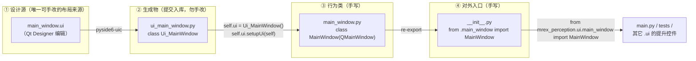
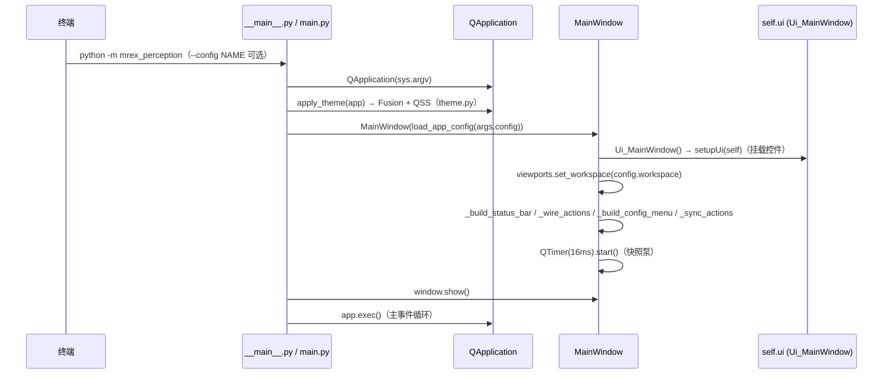
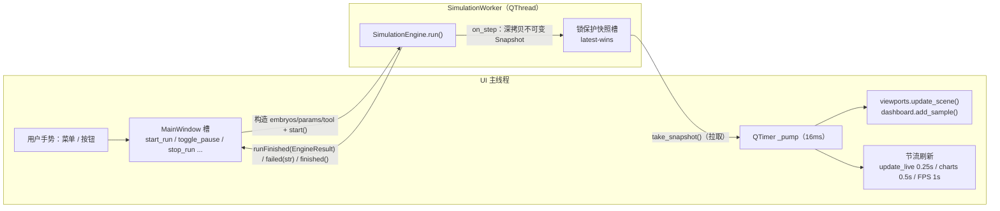

# M-REx Perception — Qt6 UI 架构与工作流

> 版本: v1.0 · 日期: 2026-10-05 · 适用代码: `feat/python-fullstack`（M4 GUI 已完成）
>
> 技术栈: **PySide6 (Qt6) + PyVista/VTK + pyqtgraph + pyside6-uic + pytest-qt**
>
> 关联文档: [`python-architecture.md`](./python-architecture.md)（总体架构 / 领域模型 / 核心层 / 线程边界概览）、[`migration-plan.md`](./migration-plan.md)（§6 M4）
>
> 目的: 把 UI 层从"布局源文件 → 生成代码 → 行为代码 → 对外导入 → 运行时装配"的完整链路一次讲清，作为后续新增/修改界面时的唯一操作依据。

---

## 1. 一句话总览

每个 Designer 型 UI 组件 = **四件套**（`.ui` 布局源 + `ui_*.py` 生成物 + `*.py` 行为类 + `__init__.py` 稳定导出）；
全局 = **一条编译链**（`pyside6-uic`）+ **一个组合根**（`MainWindow`）。

工作流速记（与项目现状逐项对应）：

```text
main_window.ui ──(pyside6-uic)──► ui_main_window.py          自动生成，勿手改
                                      │  Ui_MainWindow.setupUi(self) 挂载控件
main_window.py ──定义──► MainWindow(QMainWindow)              手写：行为 / 控制逻辑
__init__.py    ──re-export──► mrex_perception.ui.main_window  对外稳定导入路径
```



---

## 2. 职责分工（四件套各管什么）

| 文件 | 角色 | 是否可以手改 | 何时改 |
|---|---|---|---|
| `main_window.ui` | XML 布局源：窗口尺寸、菜单动作、状态栏、中央布局、控件层级 | ✅ 唯一布局真相，用 Qt Designer 编辑 | 调整界面结构/文案/快捷键时 |
| `ui_main_window.py` | `pyside6-uic` 产物：`Ui_MainWindow.setupUi()` 创建并挂载控件 | ❌ 文件头有 WARNING，重编译会覆盖 | 只由 uic 重新生成 |
| `main_window.py` | 行为类 `MainWindow`：组合 Ui、信号接线、状态同步、生命周期 | ✅ | 交互逻辑变化时 |
| `__init__.py` | 包级 re-export，提供稳定导入路径 `mrex_perception.ui.main_window` | ✅（通常一行） | 对外类名变化时才改 |

**关键点**：布局（声明式）与行为（命令式）分离；生成代码与手写代码分离；包外访问只认 `__init__.py`。

---

## 3. 为什么这是 Qt6/Python 的推荐架构

### 3.1 对应官方推荐模式

- Qt 官方文档 *Using a Designer UI File in Your Application* 给出两种集成方式：**单继承（single inheritance，把生成的 `Ui_*` 类作为成员组合进来）** 与多重继承（同时继承窗口基类与 `Ui_*` 类）。本项目全部采用**单继承 + 组合**。
- PySide6 官方教程 *Using .ui files from Designer or QtCreator with QUiLoader and pyside6-uic* 推荐用 `pyside6-uic` 把 `.ui` **编译期**生成 Python 模块（本项目做法），而不是运行时 `QUiLoader`/`loadUi` 动态加载。

### 3.2 项目内的收益

1. **多重继承的坑被规避**：MRO 顺序、基类初始化次序、IDE/类型检查器对 `Ui_*` 混入的解析问题，在组合方式下都不存在。
2. **类型检查与补全**：`self.ui` 是明确的 `Ui_MainWindow` 实例，`self.ui.actionStart` 等属性可被 Pylance/mypy 静态解析；生成文件单独排除检查（见 §5.4）。
3. **可测试性**：行为类可脱离 Designer 直接用 pytest-qt 实例化断言（`tests/test_ui.py` 的 6 个用例就是这么做的）。
4. **打包友好**：产物已是普通 `.py` 模块，PyInstaller 无需运行时调用 uic；`.ui` 仅作为源文件随包分发。
5. **稳定边界**：外部代码（`main.py`、测试、其它 `.ui` 的 Promoted Widget）只依赖包级导入路径，组件内部文件如何重组都不影响调用方（见 §9）。

### 3.3 备选方案对比

| 方案 | 结论 | 原因 |
|---|---|---|
| 纯手写 UI 代码 | ❌ | 布局调整成本高、无法在 Designer 中预览，容易与设计稿脱节 |
| 多继承 `class MainWindow(QMainWindow, Ui_MainWindow)` | ❌ | MRO 与初始化顺序隐晦；生成类改名/换工具时波及行为类 |
| 运行时 `QUiLoader` / `uic.loadUi` 加载 | ❌ | 属性无静态类型（补全/检查全丢）；打包需附带资源路径处理；启动开销 |
| `.ui` → `pyside6-uic` 生成 + 组合 | ✅ 本项目 | 官方推荐路径；静态可解析；打包简单；代价仅是"改 .ui 后必须重编译" |

---

## 4. 组件目录与命名约定

### 4.1 现状目录

```text
mrex_perception/ui/
├── __init__.py
├── theme.py                    # 全局 QSS 深色主题（Fusion）
├── worker.py                   # SimulationWorker(QThread)：引擎线程 + 快照缓冲
├── charts.py                   # ChartRecorder：pyqtgraph 三条实时曲线
├── screenshot.py               # 三视图拼图导出
├── main_window/                # ── 主窗口（Designer 型组件 · 四件套）
│   ├── __init__.py             #    re-export: MainWindow
│   ├── main_window.ui          #    布局源（Designer 编辑）
│   ├── ui_main_window.py       #    [生成] Ui_MainWindow
│   └── main_window.py          #    MainWindow：行为 / 控制逻辑
├── dashboard/                  # ── 仪表盘（Designer 型组件 · 四件套）
│   ├── __init__.py             #    re-export: DashboardPanel
│   ├── dashboard.ui            #    布局源（含 pyqtgraph.PlotWidget 提升）
│   ├── ui_dashboard.py         #    [生成] Ui_DashboardPanel
│   └── dashboard.py            #    DashboardPanel：参数属性 + 控制信号
└── viewport/                   # ── 三视图（代码型组件 · 无 .ui）
    ├── __init__.py             #    re-export: MultiViewPanel
    ├── viewport.py             #    MultiViewPanel：三个 QtInteractor 在代码中创建
    └── renderer.py             #    SceneRenderer：快照 → 网格/矩阵更新
```

> **并非所有组件都需要 `.ui`**：`viewport/` 的布局完全由代码构建（VTK 的 `QtInteractor` 无法在 Designer 中预览），因此省去 `.ui` 与生成物，但**仍保留 `__init__.py` 稳定导出**——"四件套"是 Designer 型组件的模板，导出契约对所有组件生效。

### 4.2 命名规则

| 对象 | 规则 | 示例 |
|---|---|---|
| 组件目录 | `snake_case` | `main_window/`、`dashboard/` |
| `.ui` 文件 | 与行为模块同名 | `dashboard.ui` ⇄ `dashboard.py` |
| 生成文件 | `ui_` 前缀 + 组件名 | `ui_dashboard.py` |
| 生成类 | `Ui_` + `.ui` 中的 `<class>` 名 | `<class>DashboardPanel</class>` → `Ui_DashboardPanel` |
| 行为类 | PascalCase，语义名 | `MainWindow`、`DashboardPanel`、`MultiViewPanel` |
| Designer `objectName` | camelCase（uic 会把 `name` 原样变成属性名） | `actionStart`、`countSpin`、`versionLabel` |
| Python 对外 API | snake_case（包在行为类里再暴露） | `dashboard.count`、`dashboard.target_point`、`main_window.start_run()` |

行为类应把"读取控件值"封装成 snake_case 属性（如 `DashboardPanel.count/seed/num_steps/target_point`），让业务代码**不直接触碰控件命名**——`MainWindow.start_run()` 只读 `self.dashboard.seed`，不读 `self.ui.seedSpin.value()`。

### 4.3 版本控制策略（已验证）

- **`ui_*.py` 生成物提交入库**（`git ls-files` 确认两个生成文件均被跟踪），`.ui` 与其生成物成对提交。
- 理由：克隆后 `pip install -e .` 即可运行，无需安装/调用 uic；打包链路简单；评审能看到生成差异。
- 代价与铁律：**只改 `.ui`，永不手改 `ui_*.py`**；改完 `.ui` 必须重编译并同步提交。

### 4.4 界面布局速览（现行实现）

```text
┌───────────────────────────────────────────────────────────────────┐
│ 菜单栏: File | Run | View | Help                                   │
├───────────────┬───────────────────────────────────────────────────┤
│               │  Top (XY)                │  Front (XZ)            │
│  Dashboard    │──────────────────────────┼────────────────────────│
│   ├ Control   │  Right (YZ)              │  （预留：运行汇总 /    │
│   ├ Source    │                          │    日志 — 后续）        │
│   ├ Parameters│   三视图 QtInteractor ×3  │                        │
│   ├ Telemetry │   （正交投影、独立相机）   │                        │
│   └ Charts    │                          │                        │
├───────────────┴───────────────────────────────────────────────────┤
│ 状态栏: 状态消息 · 步 k · tool [x,y,z] · FPS · PyVista 版本        │
└───────────────────────────────────────────────────────────────────┘
```

- 布局由 `main_window.ui` 定义（左 `dashboard` + 右 `viewports` 的 `QHBoxLayout`）；三视图 2×2 网格与右下角"预留"占位由 `MultiViewPanel` 在代码中构建（`QtInteractor` 无法在 Designer 中预览）。
- 菜单：File（导出截图… / 退出）、Run（Start/Pause/Step/Stop/Reset）、View（Fit All / 复位视角 / Show IDs / Show Orientation Arrows）、Help（关于）。
- Dashboard 控件（`dashboard.ui`；信号接线见 §7.3）：

| 分组 | 控件（objectName） | 说明 |
|---|---|---|
| Control | `startButton` / `pauseButton` / `stepButton` / `stopButton` / `resetButton` | 与 Run 菜单共用同一批槽函数 |
| Source | `randomRadio`（选中）/ `imageRadio`（禁用，M5）；`countSpin` / `seedSpin` | 当前仅随机源可用 |
| Parameters | `numStepsSpin`；`targetXSpin` / `targetYSpin` / `targetZSpin` | 启动时读入 `EngineParams` |
| Telemetry | `toolStateLabel` / `progressLabel` / `attemptsLabel` / `successLabel` | 文本 4 Hz 刷新（§7.5） |
| Charts | `zPlot` / `yawPlot` / `distancePlot`（提升的 `pyqtgraph.PlotWidget`） | 数据逐帧累积、重绘 2 Hz |
| 备注 | `noteLabel` | 仿真模式（Random）；YOLO（M5）与硬件（M6）后续接入 |

### 4.5 三视图渲染要点（`viewport/`）

| 元素 | 样式（`renderer.py` 常量） |
|---|---|
| 胚胎 free / selected / grasped / moved / failed / clustered | 白 `#ffffff` / 绿 `#00e05a` / 黄 `#ffd400` / 蓝 `#3b82f6` / 红 `#ff4040` / 品红 `#e879f9`（对齐 `plotEmbryos3D.m`） |
| 工具头 | 红色圆柱 `#ff2020`（`radius=0.75, height=0.5`） |
| ID 标签 / 朝向箭头 | `#e8ecf2` / `#f59e0b`；Show IDs / Show Orientation Arrows 开关控制，箭头长度 = 胚胎长 |
| 静态场景 | 工作区包围盒线框 + 源/落位区域地面矩形 + 网格 |

- 胚胎网格：单位球经 `user_matrix` 缩放 `(length/2, width/2, height/2)` + 旋转 + 平移（与 MATLAB `ellipsoid()` 视觉等价）。
- **v2-lite actor 缓存**（M4 实装）：按胚胎 id 缓存 actor，快照仅更新矩阵与状态色；ID 标签/箭头仅在开关开启时重建。
- 相机：三视图均为正交投影、独立相机；初始取景对齐工作区包围盒（`reset_camera(bounds=box)`），Fit All 可查看全场景。
- 截图：`save_three_view_png()` 将三视图横向拼为一张 PNG（File → 导出截图…，Ctrl+E）。

---

## 5. uic 编译流水线

### 5.1 命令

```bash
# 单个文件（以 main_window 为例；必须用项目 venv 里的 uic）
.venv/bin/pyside6-uic mrex_perception/ui/main_window/main_window.ui \
    -o mrex_perception/ui/main_window/ui_main_window.py
```

### 5.2 VS Code 任务（本机 `.vscode/tasks.json`，已配置）

| 任务 | 内容 |
|---|---|
| `uic: main_window.ui → ui_main_window.py` | 编译主窗口 |
| `uic: dashboard.ui → ui_dashboard.py` | 编译仪表盘 |
| `uic: 编译全部 .ui`（复合任务） | 按顺序调用上面两个，日常用这个 |

运行方式：命令面板 → **Tasks: Run Task** → `uic: 编译全部 .ui`。
（注意：`Ctrl+Shift+B` 默认 build 任务是"运行 GUI"，不是 uic。）

> ⚠️ `.vscode/` 整目录在 `.gitignore` 中，任务定义不随 git 同步。换机器时按上文命令重建，或手动执行 §5.1 命令。
> ➕ 新增 `.ui` 文件时，为它补一条 uic 任务，并加入"编译全部"复合任务的 `dependsOn`。

### 5.3 生成物特征（为什么不能手改）

`ui_main_window.py` 文件头：

```python
## Form generated from reading UI file 'main_window.ui'
## Created by: Qt User Interface Compiler version 6.11.2
## WARNING! All changes made in this file will be lost when recompiling UI file!
```

- 头部记录生成器版本；**重新编译后 `git diff` 应只反映 `.ui` 的改动用意**，若出现无关噪音，说明 uic 版本变了。
- 生成文件是纯 Python 模块，uic 解析 `<customwidgets>` 时会生成对子组件**包路径**的 import（见 §8）——这正是 `__init__.py` re-export 必须存在的原因。

### 5.4 pyproject 中的配套约定

| 配置 | 内容 | 作用 |
|---|---|---|
| `[tool.ruff] extend-exclude` | `mrex_perception/ui/**/ui_*.py` | lint 跳过所有生成物 |
| `[[tool.mypy.overrides]]` | `ui_dashboard` / `ui_main_window` 逐模块 `ignore_errors` | 类型检查跳过生成物（**新增生成文件需在此追加**） |
| `[tool.setuptools.package-data]` | `mrex_perception = ["ui/**/*.ui"]` | `.ui` 源文件随包分发 |
| `[tool.pytest.ini_options]` | `qt_api = "pyside6"` | pytest-qt 使用 PySide6 绑定 |

### 5.5 标准修改循环

```text
Qt Designer 打开 *.ui 修改
   → 运行任务「uic: 编译全部 .ui」
   → ruff / pytest（生成物不影响 lint，行为回归靠测试）
   → 手动运行 GUI 目视检查：.venv/bin/python -m mrex_perception
   → 提交 *.ui 与 ui_*.py（成对）
```

---

## 6. 生成物解剖：`Ui_MainWindow`

`setupUi(self, MainWindow)` 的执行序列（对应 `ui_main_window.py`）：

1. 设置 `objectName`、`resize(1500, 900)`；
2. 创建 12 个 `QAction`（`actionQuit/actionStart/.../actionAbout`），text/shortcut/checkable 均来自 `.ui`；
3. 构建 `centralwidget` + `QHBoxLayout`（左 `dashboard`、右 `viewports`，留白 4px、间距 8px）；
4. 构建 `menubar` 与四个菜单（File/Run/View/Help）并 `addAction`；
5. 构建 `statusbar` 与其中的 `versionLabel`；
6. `setCentralWidget` / `setMenuBar` / `setStatusBar`；
7. 调用 `retranslateUi(MainWindow)`（所有可见文案，含 `notr` 标记）；
8. `QMetaObject.connectSlotsByName(MainWindow)`。

**两条要点**：

- `.ui` 中的 `name="xxx"` 就是生成实例上的属性名 `ui.xxx`。菜单动作对象名在 `.ui` 里刻意用 `action*` 前缀，与 Designer 习惯一致。
- 生成文件自带 `connectSlotsByName`（按 `on_<objectName>_<signal>` 命名自动接线），但**本项目不依赖它**：所有连接都在 `main_window.py::_wire_actions()` 中显式 `.connect(...)`。显式接线对跳转/重构/评审更友好，避免"隐式魔法"。

主窗口关键 `objectName` 一览（在 `main_window.py` 中通过 `self.ui.<name>` 访问）：

| 分类 | objectName |
|---|---|
| 文件菜单 | `actionExportImage`（导出截图… Ctrl+E）、`actionQuit`（退出 Ctrl+Q） |
| 运行菜单 | `actionStart`（F5）、`actionPause`（F6）、`actionStep`（F7）、`actionStop`（Shift+F5）、`actionReset`（Ctrl+R） |
| 视图菜单 | `actionFitAll`（F）、`actionResetView`（0）、`actionShowIds`、`actionShowArrows` |
| 帮助菜单 | `actionAbout` |
| 中央区 | `dashboard`（DashboardPanel）、`viewports`（MultiViewPanel） |
| 状态栏 | `statusbar`、`versionLabel` |

---

## 7. 行为类解剖：`MainWindow`

### 7.1 组合初始化（固定模板）

```python
class MainWindow(QMainWindow):
    def __init__(self, config: AppConfig | None = None, parent: QWidget | None = None) -> None:
        super().__init__(parent)
        self.ui = Ui_MainWindow()      # ① 持有生成实例（防止被 GC，且可访问全部控件）
        self.ui.setupUi(self)          # ② 把控件挂载到 self 上（parent = 主窗口）
        self.dashboard = self.ui.dashboard      # ③ 公共别名（对外稳定名称）
        self.viewports = self.ui.viewports
        self._config = config if config is not None else load_app_config()  # ④ 配置注入（见 §7.2）
```

`setupUi(self)` 的语义：生成类负责**创建并摆放**控件，主窗口负责**持有与驱动**它们。`self.ui` 引用必须保留——生成实例本身就是所有控件的"索引表"。

### 7.2 文件分区（`main_window.py` 内部结构）

| 区块 | 内容 |
|---|---|
| 构造器 | 组合 Ui → 别名 → 接收注入 `AppConfig`（缺省自载 default）→ `viewports.set_workspace` → 状态字段 → 状态栏/接线/配置菜单/动作同步 → 16ms `QTimer` 泵 |
| 公共 API（测试同款入口） | `workspace`（属性）、`is_running / apply_config / start_run / toggle_pause / step_run / stop_run / reset_run / export_image` |
| 窗口/线程事件 | `closeEvent`、`_pump`、`_on_run_finished`、`_on_run_failed`、`_on_thread_finished` |
| UI 接线 | `_wire_actions`（信号 → 槽）、`_sync_actions`（按运行状态启停动作）、`_build_config_menu`（Config 菜单：枚举 `config/workspace/*.yaml`）、`_build_status_bar` |
| 杂项对话框 | `_choose_export_image`、`_show_about` |

### 7.3 信号接线表（信号向上 / 调用向下）

菜单与工具栏（`self.ui.action*`）：

| 信号 | 槽 | 语义 |
|---|---|---|
| `actionQuit.triggered` | `self.close` | 走 `closeEvent` 安全退出 |
| `actionStart.triggered` | `start_run` | 校验非运行中 → 建胚 → 起 worker |
| `actionPause.triggered` | `toggle_pause` | 暂停/恢复切换 |
| `actionStep.triggered` | `step_run` | 暂停态单步 |
| `actionStop.triggered` | `stop_run` | 请求停止（不回位、无汇总） |
| `actionReset.triggered` | `reset_run` | 清场景/遥测/图表 |
| `actionFitAll.triggered` | `viewports.fit_all` | 相机取景全部 |
| `actionResetView.triggered` | `viewports.reset_views` | 复位三视图方位 |
| `actionShowIds.toggled` | `viewports.set_show_ids` | ID 标签开关 |
| `actionShowArrows.toggled` | `viewports.set_show_arrows` | 朝向箭头开关 |
| `actionExportImage.triggered` | `_choose_export_image` | 存三视图拼图 PNG |
| `actionAbout.triggered` | `_show_about` | 关于对话框 |

子组件 → 主窗口（DashboardPanel 自定义信号，组件不反向依赖窗口）：

| 信号 | 槽 |
|---|---|
| `dashboard.startRequested / pauseRequested / stepRequested / stopRequested / resetRequested` | 同名功能槽（与菜单共用） |

> **风格约定**：子组件表达"意图"（emit 信号），主窗口决定"做什么"（调用自身方法）；主窗口对子组件只做方法调用（`viewports.update_scene(...)`、`dashboard.begin_run()`），不反向 emit。数据流单向，便于测试与推理。

### 7.4 动作可用性（`_sync_actions`）

| 动作 | 运行中 | 空闲 |
|---|---|---|
| Start / Reset | 禁用 | 启用 |
| Pause / Stop | 启用 | 禁用 |
| Step | 仅"暂停中"启用 | 禁用 |

### 7.5 定时泵与节流（macOS 实测约束）

| 常量 | 值 | 位置 | 说明 |
|---|---|---|---|
| `_TICK_MS` | 16 ms（≈60 Hz） | `main_window.py` | 主线程拉取最新快照（latest-wins） |
| `_UI_REFRESH_SECONDS` | 0.25 s | `main_window.py` | 仪表盘文本刷新；避免逐帧 Qt 重绘与 VTK swap chain 互抢（macOS） |
| `_REDRAW_SECONDS` | 0.5 s | `charts.py` | 曲线重绘节流（数据每帧累积，只降重绘频率） |
| FPS 刷新 | 1.0 s | `main_window.py` | 状态栏 FPS 统计窗口 |

### 7.6 生命周期

- `closeEvent`：停定时器 → `worker.request_stop()` → `worker.wait(1500)` → `viewports.close_plotters()` → `super().closeEvent()`。运行中关窗**不弹窗、不阻塞**（M4 验收项）。
- 运行态的 `QMessageBox` 仅用于 `failed` 信号（仿真异常），不在关窗路径上。

---

## 8. 自定义控件提升（Promoted Widget）——四件套的嵌套机制

`main_window.ui` 通过 `<customwidgets>` 声明两个提升控件（Promote）：

```xml
<customwidgets>
 <customwidget>
  <class>DashboardPanel</class>
  <extends>QWidget</extends>
  <header>mrex_perception.ui.dashboard</header>   <!-- 包路径，不是模块文件路径 -->
 </customwidget>
 <customwidget>
  <class>MultiViewPanel</class>
  <extends>QWidget</extends>
  <header>mrex_perception.ui.viewport</header>
 </customwidget>
</customwidgets>
```

uic 编译后生成的是**包级导入**：

```python
from mrex_perception.ui.dashboard import DashboardPanel
from mrex_perception.ui.viewport import MultiViewPanel
```

由此可得三条硬约束：

1. `<class>` 名必须与 `__init__.py` 中 re-export 的类**完全一致**；
2. `<header>` 必须是**可导入的包路径**（这里正是 §9 稳定导出要服务的目标之一）；
3. 被提升类要能以 `SomeWidget(parent)` 形式构造（本项目均为 `QWidget` 子类、`parent=None` 默认参数）。

`dashboard.ui` 中还把 pyqtgraph 的 `PlotWidget` 提升进来（`<header>pyqtgraph</header>`），因此三个曲线控件在 Designer 中可直接摆放，运行期由 `ChartRecorder` 绑定数据。

**Designer 操作路径**：选中占位控件 → 右键 *Promote to...* → 填类名 / 头文件 → *Promote*。多个控件提升到同一类时，Designer 自动合并到 `<customwidgets>` 区块，无需重复声明。

> ⚠️ 循环依赖防线：主窗口 `.ui` 只引用**子组件包路径**；子组件（dashboard/viewport）**不引用**主窗口。依赖方向始终由叶向根。

---

## 9. 稳定导入路径：`__init__.py` 的 re-export 契约

`main_window/__init__.py` 全文即模板：

```python
"""Main window component: Designer form (``main_window.ui``), uic output, wiring.

The public import path ``mrex_perception.ui.main_window`` is kept stable by
re-exporting the window class here.
"""

from .main_window import MainWindow

__all__ = ["MainWindow"]
```

它同时服务四类消费者：

| 消费者 | 依赖形式 |
|---|---|
| `main.py` 启动装配 | `from mrex_perception.ui.main_window import MainWindow` |
| 测试 `tests/test_ui.py` | `from mrex_perception.ui.main_window import MainWindow` |
| uic 生成代码（提升控件） | `from mrex_perception.ui.dashboard import DashboardPanel` |
| 其它组件/未来代码 | 同上，只认包路径 |

**重构规则**：组件内部文件（如把 `main_window.py` 拆成多个模块、或类改名）只允许改动包内部 + `__init__.py`；任何外部代码的 `import` 语句不变，`__all__` 提供 IDE 级别的"官方出口"清单（同时也是 `from ... import *` 的白名单）。

---

## 10. 运行时装配与数据流

### 10.1 启动链



> ⚠️ Mermaid 注意：序列图消息文本中的 ASCII 分号 `;` 会被当作语句分隔符（等同换行），会导致解析失败；需避免或用 `#59;` 转义。

入口三选一，最终都到 `main.py::main()`：`python -m mrex_perception`（`__main__.py`）、`mrex` 控制台脚本（`pyproject [project.scripts]`）、`python mrex_perception/main.py`（`__main__` 保护）。工作区配置经 `AppConfig` 聚合注入（`config/app.py`）：启动可用 `--config NAME` 选择，运行期经 Config 菜单切换（`MainWindow.apply_config`；运行中禁用，切换后下一次运行生效）。

### 10.2 运行期数据流（单向：命令 → 引擎 → 快照 → 渲染）



**线程铁律**（对应架构文档 §7）：

1. `core/**` 不 import Qt/VTK——引擎可完全无头运行（CLI 与 GUI 共用同一代码路径，测试用同 seed 对比两者结果一致）；
2. worker 线程**绝不触碰任何 widget**；与 UI 的全部交互只有：主线程发起的请求方法 + 向主线程投递的信号；
3. 快照发布后不可变，UI 侧 latest-wins 拉取，天然抗背压（渲染慢时自动丢中间帧）；
4. 暂停/单步/停止通过 `threading.Condition` 门控（`request_pause/request_step/request_stop`），停止在一个记录步内生效（M4 验收 ≤200 ms）；
5. 关窗路径：停泵 → 请求停止 → `wait(1500)` 兜底 → 关闭 plotters。

---

## 11. 新增一个 UI 组件的操作清单（Checklist）

以新增 Designer 型组件 `FooPanel` 为例：

1. **建目录**：`mrex_perception/ui/foo/`，先写 `__init__.py`（含 re-export 契约）；
2. **画布局**：Qt Designer 新建 `foo.ui`，`<class>` 用 `FooPanel`（PascalCase），`objectName` 用 camelCase；保存到组件目录；
3. **编译**：运行 `.venv/bin/pyside6-uic mrex_perception/ui/foo/foo.ui -o mrex_perception/ui/foo/ui_foo.py`；并到 `.vscode/tasks.json` 补一条 uic 任务 + 加入"编译全部 .ui"复合任务；
4. **写行为类** `foo.py`：`class FooPanel(QWidget)`，构造器里 `self.ui = Ui_FooPanel(); self.ui.setupUi(self)`；对外暴露 snake_case 属性/信号；
5. **补导出**：`__init__.py` → `from .foo import FooPanel` / `__all__ = ["FooPanel"]`；
6. **接入父界面**：在父 `.ui` 中放 `QWidget` 占位 → *Promote to...* → 类名 `FooPanel`、头文件 `mrex_perception.ui.foo`；重新编译父 `.ui`；
7. **工具链**：确认 ruff 的 `ui_*.py` 通配已覆盖新生成物；到 `pyproject.toml` 的 mypy overrides **追加** `mrex_perception.ui.foo.ui_foo`；
8. **验证**：为行为加 pytest-qt 用例；`ruff check .`；手动运行 GUI 目视检查；提交 `.ui` + `ui_foo.py` + 行为类 + `__init__.py` 成对改动。

> 若组件是代码型（如 viewport，布局无法用 Designer 表达），跳过 2/3/6，其余步骤（含稳定导出）照常。

---

## 12. 测试、检查与验收

### 12.1 自动化

| 命令 | 内容 |
|---|---|
| `.venv/bin/python -m pytest` | 全量测试；UI 用例经 `qt_api = "pyside6"` 由 pytest-qt 驱动 |
| `.venv/bin/python -m ruff check .` | lint（生成物已排除） |

`tests/test_ui.py` 现有 6 个用例，覆盖两类：架构 / 领域模型 / 核心层

- **worker 语义**：GUI 汇总 == 无头同 seed 汇总（"GUI 数据 == CLI 数据"验收项）、停止及时且无汇总、暂停冻结 + 单步推进；
- **窗口集成**：窗口跑完与无头一致并可复位、停止后安全关窗、截图导出写 PNG。

pytest-qt 要点：`qtbot.waitSignal(worker.runFinished, timeout=...)` 等待跨线程序列；测试窗口用 `qtbot.addWidget` 托管生命周期；worker 测试用 `step_delay=0.0` 加速。

### 12.2 手动冒烟

```bash
.venv/bin/python -m mrex_perception     # 启动 GUI：连跑一次 6 胚流程 + 关窗
```

### 12.3 macOS 注意事项

- **GUI 必须在非沙箱终端运行**：在 VS Code 智能体沙箱内启动会因 pasteboard/XPC 访问触发段错误（exit 139），属环境限制而非代码缺陷；pytest 可在沙箱内跑。
- **原生菜单栏**：macOS 默认把 `QMenuBar` 移入系统菜单栏（窗口内不可见、QSS 无法样式化）。`main_window.py` 中预留了 `self.ui.menubar.setNativeMenuBar(False)` 的注释行——想让菜单回到窗口内（与 Designer 预览一致）时取消注释即可。
- **渲染节流是功能而非将就**：VTK swap chain 与 Qt 重绘在 macOS 上互相竞争，§7.5 的三级节流（16ms 拉取 / 0.25s 文本 / 0.5s 图表）是实测后的刻意设计，改动前先读代码注释。

### 12.4 M4 验收基线（已通过）

6 胚全流程 GUI 跑完无卡死闪退；渲染 ≈45–60 FPS；Stop ≤200 ms；停止后关窗干净退出（见 `migration-plan.md` §6）。

---

## 13. 常见问题（FAQ）

| 问题 | 答案 |
|---|---|
| 改了 `.ui` 但界面没变？ | 忘记重编译。运行任务「uic: 编译全部 .ui」，并确认改的是源文件而不是生成物。 |
| 可以直接手改 `ui_*.py` 吗？ | 不可以。下次 uic 会整文件覆盖，且生成物不参与 lint/类型检查。改动一律回到 `.ui`。 |
| 为什么外部导入是 `mrex_perception.ui.main_window` 而不是 `...main_window.main_window`？ | 包级 re-export 契约（§9）。内部文件是私有实现，包才是 API。 |
| Designer 里提升控件只显示空盒子？ | 正常。Designer 不实例化自定义类；用 preview 或直接运行应用查看真实效果。 |
| 为什么不运行时 `loadUi`/`QUiLoader`？ | 属性无静态解析（补全、跳转、mypy 全丢）、打包资源路径复杂；编译期生成 + 提交产物更稳。 |
| 为什么 `ui_*.py` 要提交 git？ | 克隆即可运行、评审可见差异、打包简单；代价是必须遵守"只改 .ui"铁律。 |
| 子组件怎么和主窗口通信？ | 子组件只 emit 自定义信号（表达意图），主窗口接线并调用子组件方法（下发指令）；禁止子组件 import 主窗口。 |
| 新增生成文件后 mypy 报错？ | mypy 的 override 是逐模块列出的，到 `pyproject.toml` `[[tool.mypy.overrides]]` 追加新模块。 |
| `.vscode/tasks.json` 为什么不在仓库里？ | `.vscode/` 整目录被 gitignore；uic 命令以本文档 §5.1 为准，任务文件按需重建。 |

---

## 14. 参考

- Qt for Python: *Using .ui files from Designer or QtCreator with QUiLoader and pyside6-uic*（`pyside6-uic` 与运行时加载的官方对比）
- Qt: *Using a Designer UI File in Your Application*（单继承 vs 多继承两种集成方式）
- 项目内：`doc/python-architecture.md`（总体架构 / 领域模型 / 核心层）、`doc/migration-plan.md`（M4 验收清单）、`pyproject.toml`（工具链约定）、`.vscode/tasks.json`（uic 任务）、`tests/test_ui.py`（UI 回归基线）
